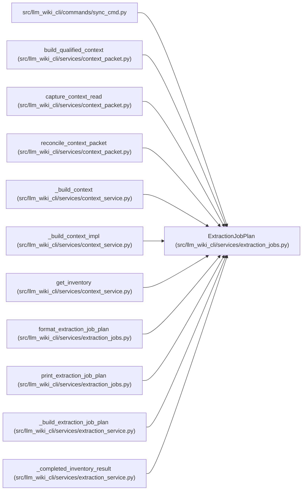

# ExtractionJobPlan

**Location:** `src/llm_wiki_cli/services/extraction_jobs.py:52`
**Kind:** Class
**Bases:** —
**Module:** [extraction_jobs](../modules/extraction_jobs.md)

**Decorators:** `@dataclass(frozen=True)`

## Description

A deterministic description of the extraction work about to run.

## Attributes

| Name | Type | Default | Description |
|------|------|---------|-------------|
| `requested_jobs` | `RequestedJobs` | `1` | — |
| `resolved_jobs` | `int` | `1` | — |
| `eligible_parallel_plans` | `int` | `0` | — |
| `effective_workers` | `int` | `0` | — |
| `parallel_plan_ids` | `tuple[str, ...]` | `()` | — |
| `sequential_plan_ids` | `tuple[str, ...]` | `()` | — |
| `cache_elided_plan_ids` | `tuple[str, ...]` | `()` | — |

## Methods

| Method | Signature | Decorators | Description |
|--------|-----------|------------|-------------|
| `to_dict` | `() -> dict[str, object]` | — | — |

## Relationships

<!-- Auto-generated relationship summary. Do not edit by hand. -->

### Summary

| Module | Methods | Attributes |
|---|---:|---|
| [extraction_jobs](../modules/extraction_jobs.md) | 1 | `cache_elided_plan_ids`, `effective_workers`, `eligible_parallel_plans`, `parallel_plan_ids`, `requested_jobs`, `resolved_jobs`, `sequential_plan_ids` |

### References

| Reference | Kind | Source | Call sites |
|---|---|---|---:|
| `sync_cmd` | import | [sync_cmd](../modules/sync_cmd.md) | — |
| `build_qualified_context` | type_reference | [context_packet](../modules/context_packet.md) | — |
| `capture_context_read` | type_reference | [context_packet](../modules/context_packet.md) | — |
| `reconcile_context_packet` | type_reference | [context_packet](../modules/context_packet.md) | — |
| `_build_context` | type_reference | [context_service](../modules/context_service.md) | — |
| `_build_context_impl` | type_reference | [context_service](../modules/context_service.md) | — |
| `get_inventory` | type_reference | [context_service](../modules/context_service.md) | — |
| `format_extraction_job_plan` | type_reference | [extraction_jobs](../modules/extraction_jobs.md) | — |
| `print_extraction_job_plan` | type_reference | [extraction_jobs](../modules/extraction_jobs.md) | — |
| `_build_extraction_job_plan` | call | [extraction_service](../modules/extraction_service.md) | 1 |
| `_build_extraction_job_plan` | type_reference | [extraction_service](../modules/extraction_service.md) | — |
| `_completed_inventory_result` | type_reference | [extraction_service](../modules/extraction_service.md) | — |

> References: showing 12 of 16 logical references; 4 omitted by the 12-row generated summary limit.
