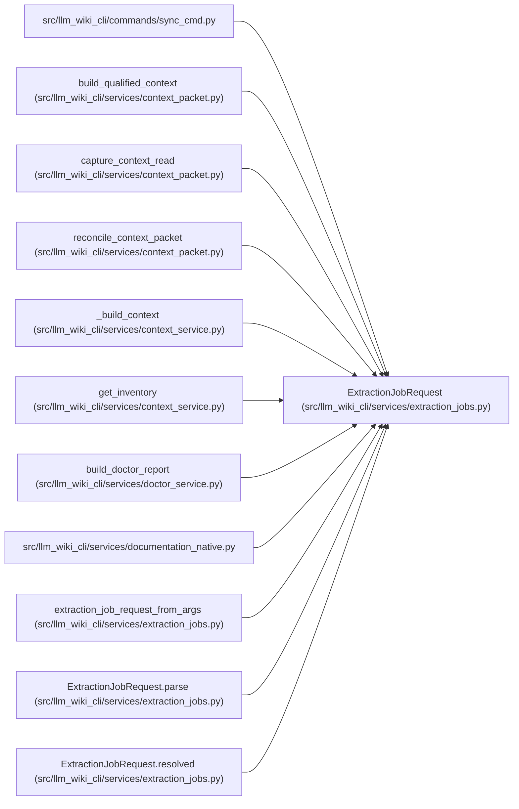

# ExtractionJobRequest

**Location:** `src/llm_wiki_cli/services/extraction_jobs.py:14`
**Kind:** Class
**Bases:** —
**Module:** [extraction_jobs](../modules/extraction_jobs.md)

**Decorators:** `@dataclass(frozen=True)`

## Description

The user-facing extractor job request and its resolved worker limit.

## Attributes

| Name | Type | Default | Description |
|------|------|---------|-------------|
| `requested_jobs` | `RequestedJobs` | *required* | — |
| `resolved_jobs` | `int` | *required* | — |

## Methods

| Method | Signature | Decorators | Description |
|--------|-----------|------------|-------------|
| `parse` | `(value: object) -> 'ExtractionJobRequest'` | `@classmethod` | — |
| `resolved` | `(value: int) -> 'ExtractionJobRequest'` | `@classmethod` | — |

## Relationships

<!-- Auto-generated relationship summary. Do not edit by hand. -->

### Summary

| Module | Methods | Attributes |
|---|---:|---|
| [extraction_jobs](../modules/extraction_jobs.md) | 2 | `requested_jobs`, `resolved_jobs` |

### References

| Reference | Kind | Source |
|---|---|---|
| `sync_cmd` | import | [sync_cmd](../modules/sync_cmd.md) |
| `build_qualified_context` | type_reference | [context_packet](../modules/context_packet.md) |
| `capture_context_read` | type_reference | [context_packet](../modules/context_packet.md) |
| `reconcile_context_packet` | type_reference | [context_packet](../modules/context_packet.md) |
| `_build_context` | type_reference | [context_service](../modules/context_service.md) |
| `get_inventory` | type_reference | [context_service](../modules/context_service.md) |
| `build_doctor_report` | type_reference | [doctor_service](../modules/doctor_service.md) |
| `documentation_native` | import | [documentation_native](../modules/documentation_native.md) |
| `extraction_job_request_from_args` | call | [extraction_jobs](../modules/extraction_jobs.md) |
| `extraction_job_request_from_args` | type_reference | [extraction_jobs](../modules/extraction_jobs.md) |
| `ExtractionJobRequest.parse` | type_reference | [extraction_jobs](../modules/extraction_jobs.md) |
| `ExtractionJobRequest.resolved` | type_reference | [extraction_jobs](../modules/extraction_jobs.md) |
