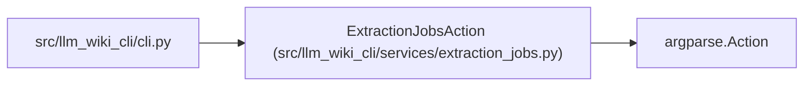

# ExtractionJobsAction

**Location:** `src/llm_wiki_cli/services/extraction_jobs.py:39`
**Kind:** Class
**Bases:** `argparse.Action`
**Module:** [extraction_jobs](../modules/extraction_jobs.md)

## Description

Resolve ``--jobs`` while preserving whether automatic sizing was requested.

## Attributes

*No annotated attributes found.*

## Methods

| Method | Signature | Decorators | Description |
|--------|-----------|------------|-------------|
| `__call__` | `(parser, namespace, values, option_string = None) -> None` | — | — |

## Relationships

<!-- Auto-generated relationship summary. Do not edit by hand. -->

### Summary

| Module | Methods | Attributes |
|---|---:|---|
| [extraction_jobs](../modules/extraction_jobs.md) | 1 | — |

### Structure

| Kind | Entity | Module |
|---|---|---|
| Base | `argparse.Action` | — |

### References

| Reference | Kind | Source | Call sites |
|---|---|---|---:|
| `cli` | import | [cli](../modules/cli.md) | — |
