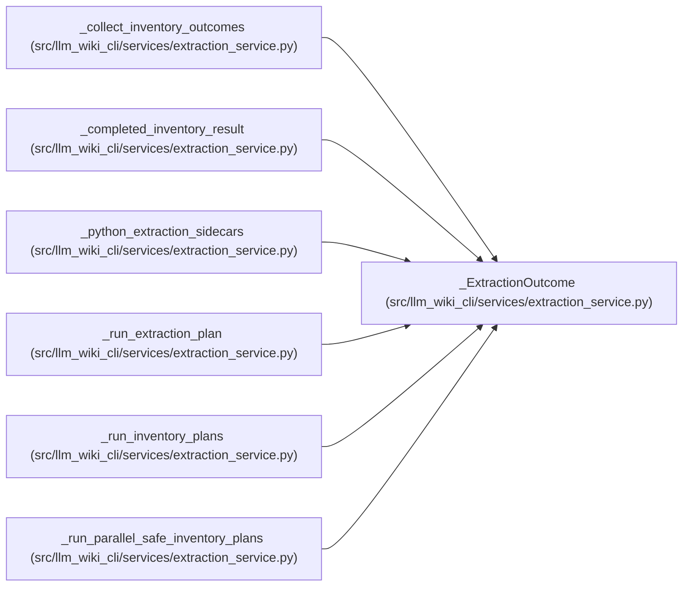

# _ExtractionOutcome

**Location:** `src/llm_wiki_cli/services/extraction_service.py:250`
**Kind:** Class
**Bases:** —
**Module:** [extraction_service](../modules/extraction_service.md)

**Decorators:** `@dataclass(frozen=True)`

## Description

_Auto-generated from `_ExtractionOutcome` in `src/llm_wiki_cli/services/extraction_service.py`._

## Attributes

| Name | Type | Default | Description |
|------|------|---------|-------------|
| `language` | `str` | *required* | — |
| `state` | `str` | *required* | — |
| `files_found` | `int` | *required* | — |
| `extracted` | `dict` | *required* | — |
| `message` | `str` | `''` | — |
| `data_effect_observations` | `dict \| None` | `None` | — |
| `import_observations` | `dict \| None` | `None` | — |

## Methods

*No public methods. Inherits from base classes.*

## Relationships

<!-- Auto-generated relationship summary. Do not edit by hand. -->

### Summary

| Module | Methods | Attributes |
|---|---:|---|
| [extraction_service](../modules/extraction_service.md) | 0 | `data_effect_observations`, `extracted`, `files_found`, `import_observations`, `language`, `message`, `state` |

### References

| Reference | Kind | Source |
|---|---|---|
| `_collect_inventory_outcomes` | type_reference | [extraction_service](../modules/extraction_service.md) |
| `_completed_inventory_result` | type_reference | [extraction_service](../modules/extraction_service.md) |
| `_python_extraction_sidecars` | type_reference | [extraction_service](../modules/extraction_service.md) |
| `_run_extraction_plan` | call | [extraction_service](../modules/extraction_service.md) |
| `_run_extraction_plan` | call | [extraction_service](../modules/extraction_service.md) |
| `_run_extraction_plan` | call | [extraction_service](../modules/extraction_service.md) |
| `_run_extraction_plan` | call | [extraction_service](../modules/extraction_service.md) |
| `_run_extraction_plan` | type_reference | [extraction_service](../modules/extraction_service.md) |
| `_run_inventory_plans` | type_reference | [extraction_service](../modules/extraction_service.md) |
| `_run_parallel_safe_inventory_plans` | call | [extraction_service](../modules/extraction_service.md) |
| `_run_parallel_safe_inventory_plans` | type_reference | [extraction_service](../modules/extraction_service.md) |
