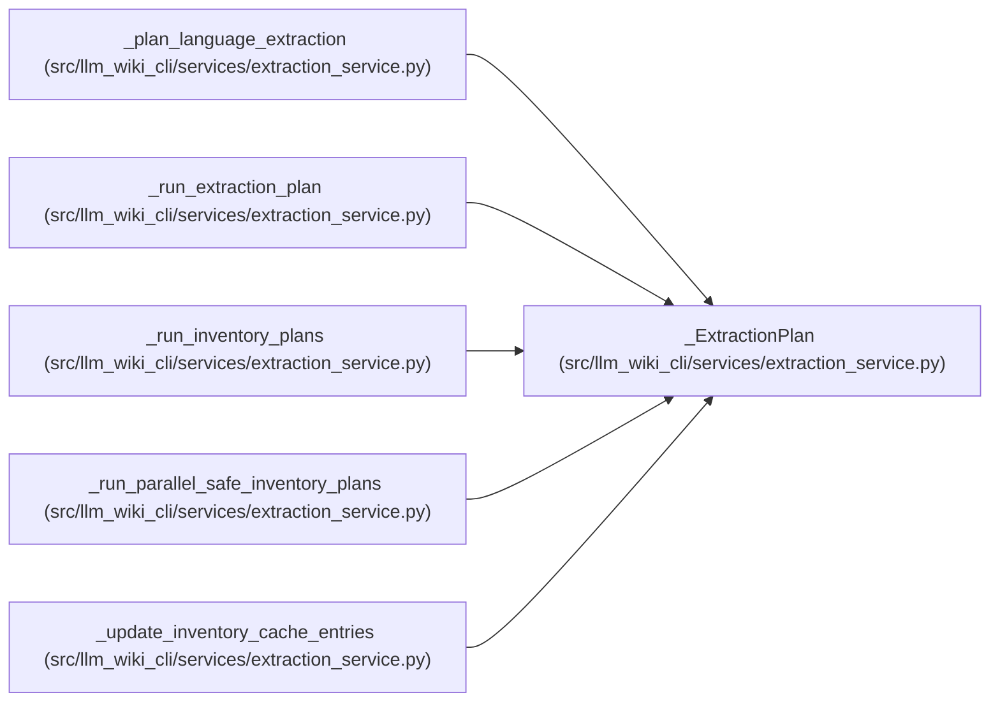

# _ExtractionPlan

**Location:** `src/llm_wiki_cli/services/extraction_service.py:237`
**Kind:** Class
**Bases:** —
**Module:** [extraction_service](../modules/extraction_service.md)

**Decorators:** `@dataclass(frozen=True)`

## Description

_Auto-generated from `_ExtractionPlan` in `src/llm_wiki_cli/services/extraction_service.py`._

## Attributes

| Name | Type | Default | Description |
|------|------|---------|-------------|
| `language` | `str` | *required* | — |
| `entry_point` | `str` | *required* | — |
| `is_builtin` | `bool` | *required* | — |
| `parallel_safe` | `bool` | *required* | — |
| `source_files` | `list[str] \| None` | *required* | — |
| `fresh_source_files` | `list[str]` | *required* | — |
| `files_found` | `int` | *required* | — |
| `kwargs` | `dict` | *required* | — |
| `plugin_root` | `str \| None` | `None` | — |

## Methods

*No public methods. Inherits from base classes.*

## Relationships

<!-- Auto-generated relationship summary. Do not edit by hand. -->

### Summary

| Module | Methods | Attributes |
|---|---:|---|
| [extraction_service](../modules/extraction_service.md) | 0 | `entry_point`, `files_found`, `fresh_source_files`, `is_builtin`, `kwargs`, `language`, `parallel_safe`, `plugin_root`, `source_files` |

### References

| Reference | Kind | Source | Call sites |
|---|---|---|---:|
| `_plan_language_extraction` | call | [extraction_service](../modules/extraction_service.md) | 1 |
| `_plan_language_extraction` | type_reference | [extraction_service](../modules/extraction_service.md) | — |
| `_run_extraction_plan` | type_reference | [extraction_service](../modules/extraction_service.md) | — |
| `_run_inventory_plans` | type_reference | [extraction_service](../modules/extraction_service.md) | — |
| `_run_parallel_safe_inventory_plans` | type_reference | [extraction_service](../modules/extraction_service.md) | — |
| `_update_inventory_cache_entries` | type_reference | [extraction_service](../modules/extraction_service.md) | — |
