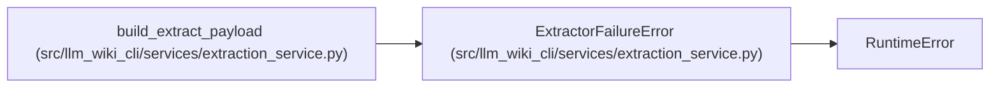

# ExtractorFailureError

**Location:** `src/llm_wiki_cli/services/extraction_service.py:212`
**Kind:** Class
**Bases:** `RuntimeError`
**Module:** [extraction_service](../modules/extraction_service.md)

## Description

Raised when one or more extractors fail during payload construction.

## Attributes

*No annotated attributes found.*

## Methods

| Method | Signature | Decorators | Description |
|--------|-----------|------------|-------------|
| `__init__` | `(result: InventoryResult)` | — | — |

## Relationships

<!-- Auto-generated relationship summary. Do not edit by hand. -->

### Summary

| Module | Methods | Attributes |
|---|---:|---|
| [extraction_service](../modules/extraction_service.md) | 1 | — |

### Structure

| Kind | Entity | Module |
|---|---|---|
| Base | `RuntimeError` | — |

### References

| Reference | Kind | Source | Call sites |
|---|---|---|---:|
| `build_extract_payload` | call | [extraction_service](../modules/extraction_service.md) | 1 |
