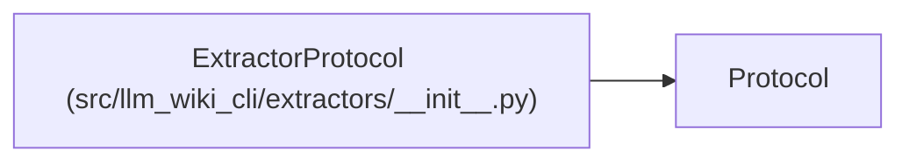

# ExtractorProtocol

**Location:** `src/llm_wiki_cli/extractors/__init__.py:8`
**Kind:** Class
**Bases:** `Protocol`
**Module:** [extractors___init__](../modules/extractors___init__.md)

## Description

Protocol that all language extractors must implement.

An extractor is responsible for scanning source files of a particular
language, parsing their structure (classes, functions, imports, etc.)
and returning a uniform inventory dict.

Each value in the returned inventory dict **must** include a
``"language"`` key identifying which language produced the entry.

## Attributes

*No annotated attributes found.*

## Methods

| Method | Signature | Decorators | Description |
|--------|-----------|------------|-------------|
| `extract` | `(src_dir: str, only_files: list[str] \| None = None, deep: bool = False) -> dict` | — | Scan *src_dir* and return an inventory dict mapping filepath → file_entry. |

## Relationships

<!-- Auto-generated relationship summary. Do not edit by hand. -->

### Summary

| Module | Methods | Attributes |
|---|---:|---|
| [extractors___init__](../modules/extractors___init__.md) | 1 | — |

### Structure

| Kind | Entity | Module |
|---|---|---|
| Base | `Protocol` | — |
