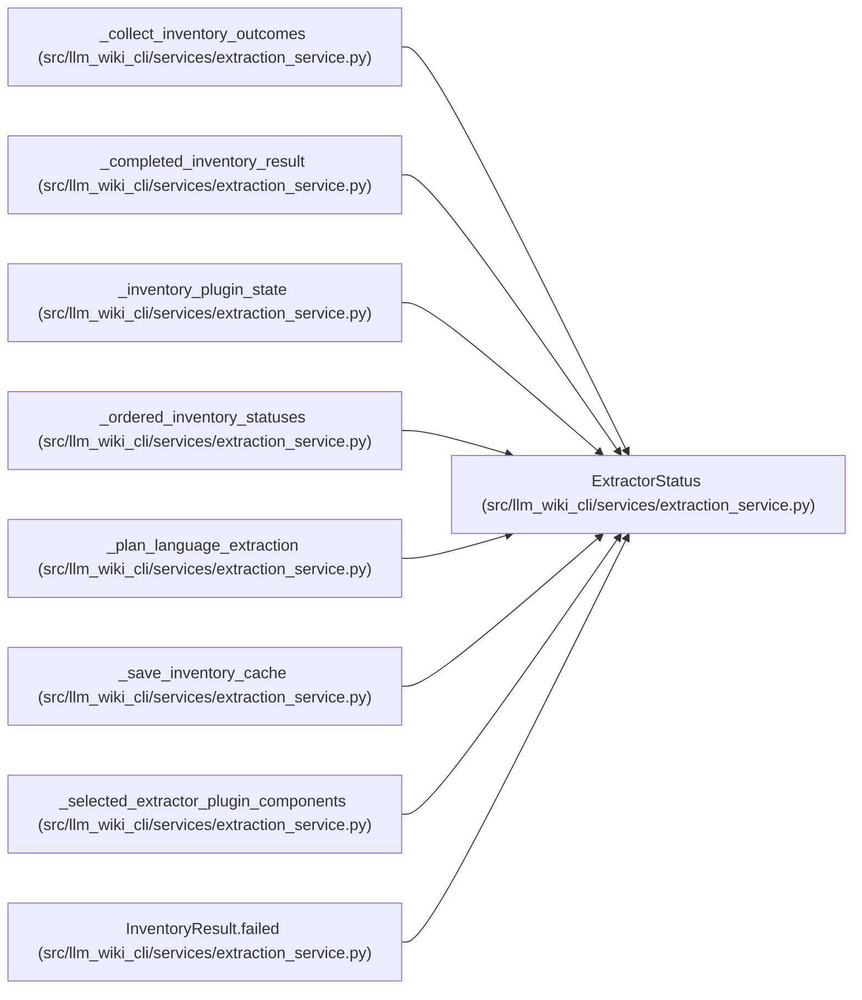

# ExtractorStatus

**Location:** `src/llm_wiki_cli/services/extraction_service.py:127`
**Kind:** Class
**Bases:** —
**Module:** [extraction_service](../modules/extraction_service.md)

**Decorators:** `@dataclass(frozen=True)`

## Description

_Auto-generated from `ExtractorStatus` in `src/llm_wiki_cli/services/extraction_service.py`._

## Attributes

| Name | Type | Default | Description |
|------|------|---------|-------------|
| `language` | `str` | *required* | — |
| `state` | `str` | *required* | — |
| `files_found` | `int` | *required* | — |
| `message` | `str` | `''` | — |

## Methods

*No public methods. Inherits from base classes.*

## Relationships

<!-- Auto-generated relationship summary. Do not edit by hand. -->

### Summary

| Module | Methods | Attributes |
|---|---:|---|
| [extraction_service](../modules/extraction_service.md) | 0 | `files_found`, `language`, `message`, `state` |

### References

| Reference | Kind | Source | Call sites |
|---|---|---|---:|
| `_collect_inventory_outcomes` | call | [extraction_service](../modules/extraction_service.md) | 2 |
| `_completed_inventory_result` | type_reference | [extraction_service](../modules/extraction_service.md) | — |
| `_inventory_plugin_state` | type_reference | [extraction_service](../modules/extraction_service.md) | — |
| `_ordered_inventory_statuses` | type_reference | [extraction_service](../modules/extraction_service.md) | — |
| `_plan_language_extraction` | call | [extraction_service](../modules/extraction_service.md) | 2 |
| `_plan_language_extraction` | type_reference | [extraction_service](../modules/extraction_service.md) | — |
| `_save_inventory_cache` | type_reference | [extraction_service](../modules/extraction_service.md) | — |
| `_selected_extractor_plugin_components` | type_reference | [extraction_service](../modules/extraction_service.md) | — |
| `InventoryResult.failed` | type_reference | [extraction_service](../modules/extraction_service.md) | — |
