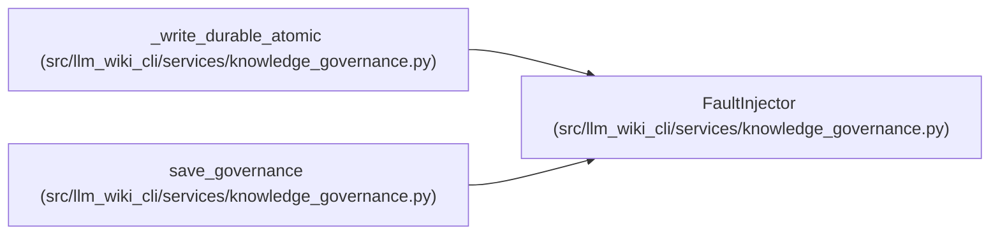

# FaultInjector

**Location:** `src/llm_wiki_cli/services/knowledge_governance.py:358`
**Kind:** Type alias
**Bases:** —
**Module:** [knowledge_governance](../modules/knowledge_governance.md)
**Target:** `Callable[[GovernanceWriteStage], None]`

## Description

_Auto-generated from `FaultInjector` in `src/llm_wiki_cli/services/knowledge_governance.py`._

## Attributes

*No annotated attributes found.*

## Methods

*No public methods. Inherits from base classes.*

## Relationships

<!-- Auto-generated relationship summary. Do not edit by hand. -->

### Summary

| Module | Methods | Attributes |
|---|---:|---|
| [knowledge_governance](../modules/knowledge_governance.md) | 0 | — |

### References

| Reference | Kind | Source |
|---|---|---|
| `_write_durable_atomic` | type_reference | [knowledge_governance](../modules/knowledge_governance.md) |
| `save_governance` | type_reference | [knowledge_governance](../modules/knowledge_governance.md) |
