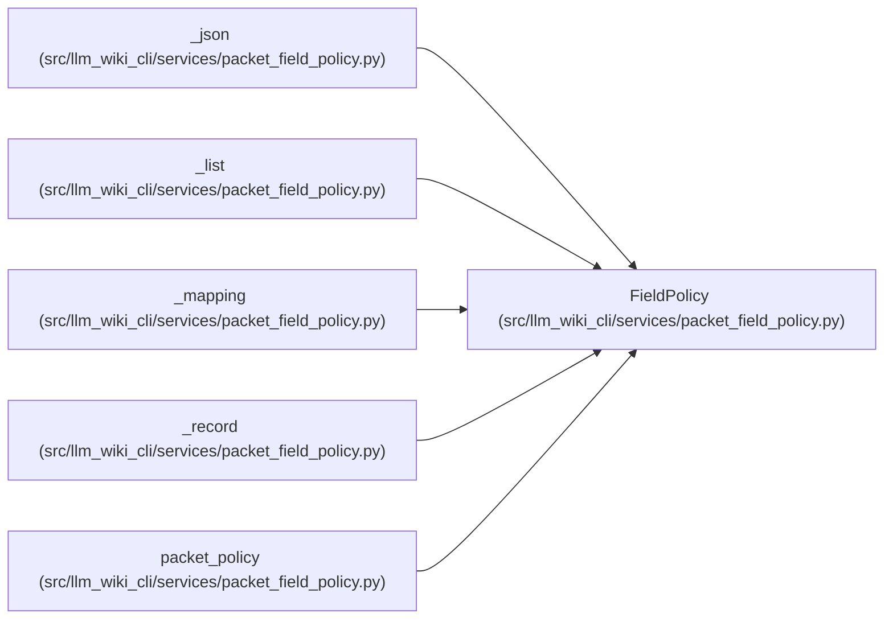

# FieldPolicy

**Location:** `src/llm_wiki_cli/services/packet_field_policy.py:16`
**Kind:** Class
**Bases:** —
**Module:** [packet_field_policy](../modules/packet_field_policy.md)

**Decorators:** `@dataclass(frozen=True)`

## Description

_Auto-generated from `FieldPolicy` in `src/llm_wiki_cli/services/packet_field_policy.py`._

## Attributes

| Name | Type | Default | Description |
|------|------|---------|-------------|
| `kind` | `str` | `'scalar'` | — |
| `fields` | `Mapping[str, 'FieldPolicy']` | `field(default_factory=lambda: MappingProxyType({}))` | — |
| `item` | `'FieldPolicy \| None'` | `None` | — |
| `key_policy` | `str` | `'schema-field'` | — |
| `reason` | `str` | `''` | — |

## Methods

*No public methods. Inherits from base classes.*

## Relationships

<!-- Auto-generated relationship summary. Do not edit by hand. -->

### Summary

| Module | Methods | Attributes |
|---|---:|---|
| [packet_field_policy](../modules/packet_field_policy.md) | 0 | `fields`, `item`, `key_policy`, `kind`, `reason` |

### References

| Reference | Kind | Source | Call sites |
|---|---|---|---:|
| `_json` | call | [packet_field_policy](../modules/packet_field_policy.md) | 1 |
| `_json` | type_reference | [packet_field_policy](../modules/packet_field_policy.md) | — |
| `_list` | call | [packet_field_policy](../modules/packet_field_policy.md) | 1 |
| `_list` | type_reference | [packet_field_policy](../modules/packet_field_policy.md) | — |
| `_mapping` | call | [packet_field_policy](../modules/packet_field_policy.md) | 1 |
| `_mapping` | type_reference | [packet_field_policy](../modules/packet_field_policy.md) | — |
| `_record` | call | [packet_field_policy](../modules/packet_field_policy.md) | 1 |
| `_record` | type_reference | [packet_field_policy](../modules/packet_field_policy.md) | — |
| `packet_policy` | type_reference | [packet_field_policy](../modules/packet_field_policy.md) | — |
