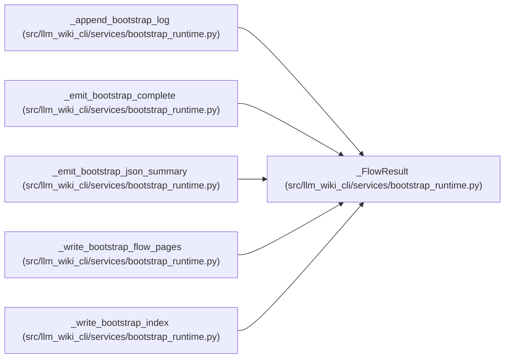

# _FlowResult

**Location:** `src/llm_wiki_cli/services/bootstrap_runtime.py:4141`
**Kind:** Class
**Bases:** —
**Module:** [bootstrap_runtime](../modules/bootstrap_runtime.md)

**Decorators:** `@dataclass(frozen=True)`

## Description

_Auto-generated from `_FlowResult` in `src/llm_wiki_cli/services/bootstrap_runtime.py`._

## Attributes

| Name | Type | Default | Description |
|------|------|---------|-------------|
| `entries` | `list[dict]` | *required* | — |
| `created` | `int` | *required* | — |
| `data_flow_summary` | `dict` | *required* | — |
| `entrypoint_observations` | `dict` | `field(default_factory=dict)` | — |
| `flows` | `list[dict]` | `field(default_factory=list)` | — |
| `data_flows` | `list[dict]` | `field(default_factory=list)` | — |

## Methods

*No public methods. Inherits from base classes.*

## Relationships

<!-- Auto-generated relationship summary. Do not edit by hand. -->

### Summary

| Module | Methods | Attributes |
|---|---:|---|
| [bootstrap_runtime](../modules/bootstrap_runtime.md) | 0 | `created`, `data_flow_summary`, `data_flows`, `entries`, `entrypoint_observations`, `flows` |

### References

| Reference | Kind | Source | Call sites |
|---|---|---|---:|
| `_append_bootstrap_log` | type_reference | [bootstrap_runtime](../modules/bootstrap_runtime.md) | — |
| `_emit_bootstrap_complete` | type_reference | [bootstrap_runtime](../modules/bootstrap_runtime.md) | — |
| `_emit_bootstrap_json_summary` | type_reference | [bootstrap_runtime](../modules/bootstrap_runtime.md) | — |
| `_write_bootstrap_flow_pages` | call | [bootstrap_runtime](../modules/bootstrap_runtime.md) | 2 |
| `_write_bootstrap_flow_pages` | type_reference | [bootstrap_runtime](../modules/bootstrap_runtime.md) | — |
| `_write_bootstrap_index` | type_reference | [bootstrap_runtime](../modules/bootstrap_runtime.md) | — |
