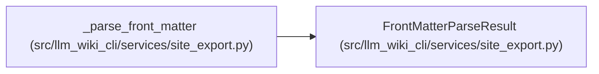

# FrontMatterParseResult

**Location:** `src/llm_wiki_cli/services/site_export.py:265`
**Kind:** Class
**Bases:** —
**Module:** [site_export](../modules/site_export.md)

**Decorators:** `@dataclass(frozen=True)`

## Description

_Auto-generated from `FrontMatterParseResult` in `src/llm_wiki_cli/services/site_export.py`._

## Attributes

| Name | Type | Default | Description |
|------|------|---------|-------------|
| `exists` | `bool` | *required* | — |
| `metadata` | `dict[str, Any]` | `field(default_factory=dict)` | — |
| `issue` | `Optional[dict[str, str]]` | `None` | — |

## Methods

*No public methods. Inherits from base classes.*

## Relationships

<!-- Auto-generated relationship summary. Do not edit by hand. -->

### Summary

| Module | Methods | Attributes |
|---|---:|---|
| [site_export](../modules/site_export.md) | 0 | `exists`, `issue`, `metadata` |

### References

| Reference | Kind | Source | Call sites |
|---|---|---|---:|
| `_parse_front_matter` | call | [site_export](../modules/site_export.md) | 10 |
| `_parse_front_matter` | type_reference | [site_export](../modules/site_export.md) | — |
