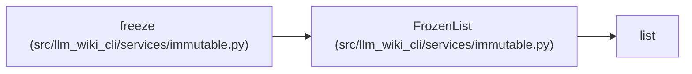

# FrozenList

**Location:** `src/llm_wiki_cli/services/immutable.py:28`
**Kind:** Class
**Bases:** `list`
**Module:** [immutable](../modules/immutable.md)

## Description

_Auto-generated from `FrozenList` in `src/llm_wiki_cli/services/immutable.py`._

## Attributes

*No annotated attributes found.*

## Methods

| Method | Signature | Decorators | Description |
|--------|-----------|------------|-------------|
| `__deepcopy__` | `(memo)` | — | — |

## Relationships

<!-- Auto-generated relationship summary. Do not edit by hand. -->

### Summary

| Module | Methods | Attributes |
|---|---:|---|
| [immutable](../modules/immutable.md) | 1 | — |

### Structure

| Kind | Entity | Module |
|---|---|---|
| Base | `list` | — |

### References

| Reference | Kind | Source | Call sites |
|---|---|---|---:|
| `freeze` | call | [immutable](../modules/immutable.md) | 1 |
