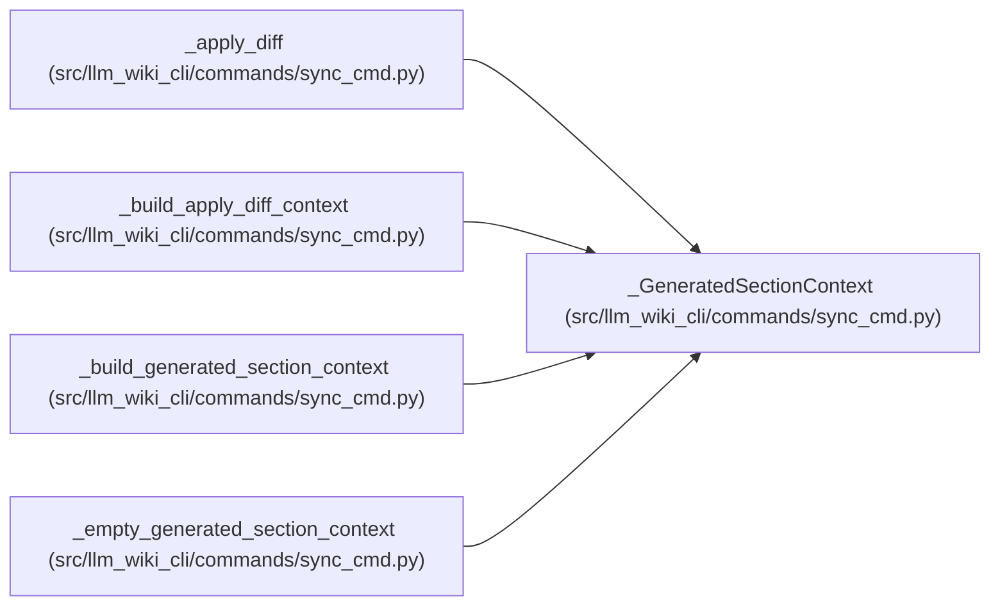

# _GeneratedSectionContext

**Location:** `src/llm_wiki_cli/commands/sync_cmd.py:646`
**Kind:** Class
**Bases:** —
**Module:** [sync_cmd](../modules/sync_cmd.md)

**Decorators:** `@dataclass(frozen=True)`

## Description

_Auto-generated from `_GeneratedSectionContext` in `src/llm_wiki_cli/commands/sync_cmd.py`._

## Attributes

| Name | Type | Default | Description |
|------|------|---------|-------------|
| `entity_relationship_summaries` | `Mapping[tuple[str, str], Mapping]` | *required* | — |
| `module_dependency_maps` | `dict[str, dict] \| None` | `None` | — |
| `dependency_analysis` | `dict \| None` | `None` | — |

## Methods

*No public methods. Inherits from base classes.*

## Relationships

<!-- Auto-generated relationship summary. Do not edit by hand. -->

### Summary

| Module | Methods | Attributes |
|---|---:|---|
| [sync_cmd](../modules/sync_cmd.md) | 0 | `dependency_analysis`, `entity_relationship_summaries`, `module_dependency_maps` |

### References

| Reference | Kind | Source |
|---|---|---|
| `_apply_diff` | type_reference | [sync_cmd](../modules/sync_cmd.md) |
| `_build_apply_diff_context` | type_reference | [sync_cmd](../modules/sync_cmd.md) |
| `_build_generated_section_context` | call | [sync_cmd](../modules/sync_cmd.md) |
| `_build_generated_section_context` | type_reference | [sync_cmd](../modules/sync_cmd.md) |
| `_empty_generated_section_context` | call | [sync_cmd](../modules/sync_cmd.md) |
| `_empty_generated_section_context` | type_reference | [sync_cmd](../modules/sync_cmd.md) |
