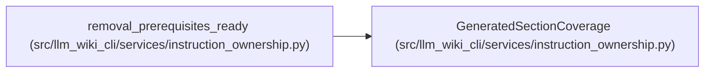

# GeneratedSectionCoverage

**Location:** `src/llm_wiki_cli/services/instruction_ownership.py:99`
**Kind:** Class
**Bases:** —
**Module:** [instruction_ownership](../modules/instruction_ownership.md)

**Decorators:** `@dataclass(frozen=True)`

## Description

Single-owner record for one current generated section.

## Attributes

| Name | Type | Default | Description |
|------|------|---------|-------------|
| `section` | `str` | *required* | — |
| `source_heading` | `str \| None` | *required* | — |
| `owner` | `InstructionOwner` | *required* | — |
| `destinations` | `tuple[InstructionDestination, ...]` | `()` | — |
| `routes` | `tuple[InstructionRoute, ...]` | `()` | — |
| `retained_kernel` | `bool` | `False` | — |
| `condition` | `SectionCondition` | `SectionCondition.ALWAYS` | — |
| `profiles` | `tuple[SchemaRenderProfile, ...]` | `_ALL_PROFILES` | — |

## Methods

*No public methods. Inherits from base classes.*

## Relationships

<!-- Auto-generated relationship summary. Do not edit by hand. -->

### Summary

| Module | Methods | Attributes |
|---|---:|---|
| [instruction_ownership](../modules/instruction_ownership.md) | 0 | `condition`, `destinations`, `owner`, `profiles`, `retained_kernel`, `routes`, `section`, `source_heading` |

### References

| Reference | Kind | Source |
|---|---|---|
| `removal_prerequisites_ready` | type_reference | [instruction_ownership](../modules/instruction_ownership.md) |
