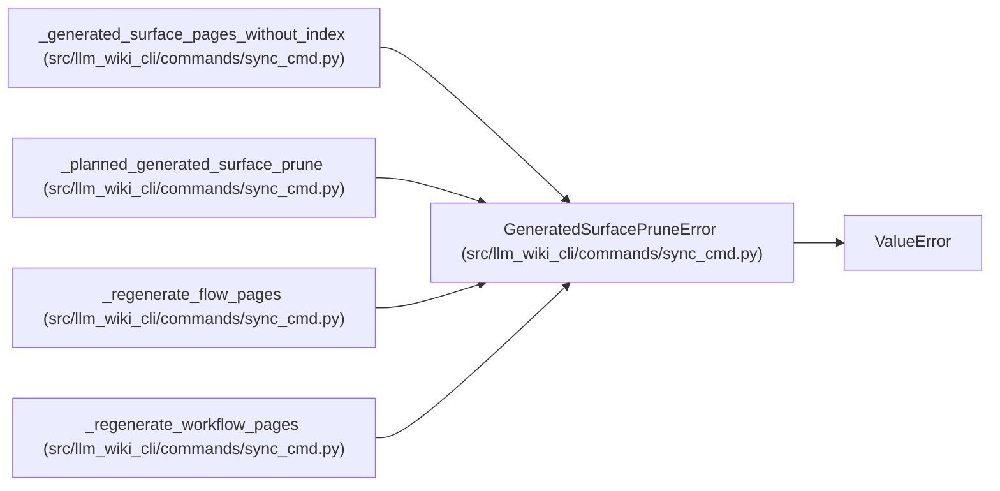

# GeneratedSurfacePruneError

**Location:** `src/llm_wiki_cli/commands/sync_cmd.py:256`
**Kind:** Class
**Bases:** `ValueError`
**Module:** [sync_cmd](../modules/sync_cmd.md)

## Description

A stale generated page cannot be removed without explicit authority.

## Attributes

*No annotated attributes found.*

## Methods

*No public methods. Inherits from base classes.*

## Relationships

<!-- Auto-generated relationship summary. Do not edit by hand. -->

### Summary

| Module | Methods | Attributes |
|---|---:|---|
| [sync_cmd](../modules/sync_cmd.md) | 0 | — |

### Structure

| Kind | Entity | Module |
|---|---|---|
| Base | `ValueError` | — |

### References

| Reference | Kind | Source | Call sites |
|---|---|---|---:|
| `_generated_surface_pages_without_index` | call | [sync_cmd](../modules/sync_cmd.md) | 3 |
| `_planned_generated_surface_prune` | call | [sync_cmd](../modules/sync_cmd.md) | 11 |
| `_regenerate_flow_pages` | call | [sync_cmd](../modules/sync_cmd.md) | 1 |
| `_regenerate_workflow_pages` | call | [sync_cmd](../modules/sync_cmd.md) | 1 |
