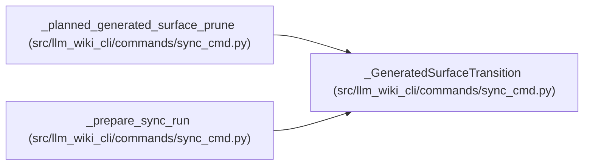

# _GeneratedSurfaceTransition

**Location:** `src/llm_wiki_cli/commands/sync_cmd.py:1705`
**Kind:** Class
**Bases:** —
**Module:** [sync_cmd](../modules/sync_cmd.md)

**Decorators:** `@dataclass(frozen=True)`

## Description

Prior ownership proof and generated pages that cross the live boundary.

## Attributes

| Name | Type | Default | Description |
|------|------|---------|-------------|
| `retired_page_paths` | `tuple[str, ...]` | `()` | — |
| `managed_flow_page_paths` | `frozenset[str]` | `frozenset()` | — |
| `managed_workflow_page_paths` | `frozenset[str]` | `frozenset()` | — |
| `managed_surface_index` | `bool` | `False` | — |
| `prior_source_overrides` | `tuple[tuple[str, str], ...]` | `()` | — |
| `prior_flow_entries` | `tuple[dict, ...]` | `()` | — |

## Methods

*No public methods. Inherits from base classes.*

## Relationships

<!-- Auto-generated relationship summary. Do not edit by hand. -->

### Summary

| Module | Methods | Attributes |
|---|---:|---|
| [sync_cmd](../modules/sync_cmd.md) | 0 | `managed_flow_page_paths`, `managed_surface_index`, `managed_workflow_page_paths`, `prior_flow_entries`, `prior_source_overrides`, `retired_page_paths` |

### References

| Reference | Kind | Source |
|---|---|---|
| `_planned_generated_surface_prune` | call | [sync_cmd](../modules/sync_cmd.md) |
| `_planned_generated_surface_prune` | call | [sync_cmd](../modules/sync_cmd.md) |
| `_planned_generated_surface_prune` | type_reference | [sync_cmd](../modules/sync_cmd.md) |
| `_prepare_sync_run` | call | [sync_cmd](../modules/sync_cmd.md) |
