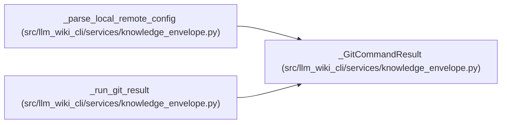

# _GitCommandResult

**Location:** `src/llm_wiki_cli/services/knowledge_envelope.py:76`
**Kind:** Class
**Bases:** —
**Module:** [knowledge_envelope](../modules/knowledge_envelope.md)

**Decorators:** `@dataclass(frozen=True)`

## Description

_Auto-generated from `_GitCommandResult` in `src/llm_wiki_cli/services/knowledge_envelope.py`._

## Attributes

| Name | Type | Default | Description |
|------|------|---------|-------------|
| `available` | `bool` | *required* | — |
| `returncode` | `int \| None` | *required* | — |
| `output` | `str` | `''` | — |

## Methods

| Method | Signature | Decorators | Description |
|--------|-----------|------------|-------------|
| `succeeded` | `() -> bool` | `@property` | — |

## Relationships

<!-- Auto-generated relationship summary. Do not edit by hand. -->

### Summary

| Module | Methods | Attributes |
|---|---:|---|
| [knowledge_envelope](../modules/knowledge_envelope.md) | 1 | `available`, `output`, `returncode` |

### References

| Reference | Kind | Source |
|---|---|---|
| `_parse_local_remote_config` | type_reference | [knowledge_envelope](../modules/knowledge_envelope.md) |
| `_run_git_result` | call | [knowledge_envelope](../modules/knowledge_envelope.md) |
| `_run_git_result` | call | [knowledge_envelope](../modules/knowledge_envelope.md) |
| `_run_git_result` | type_reference | [knowledge_envelope](../modules/knowledge_envelope.md) |
