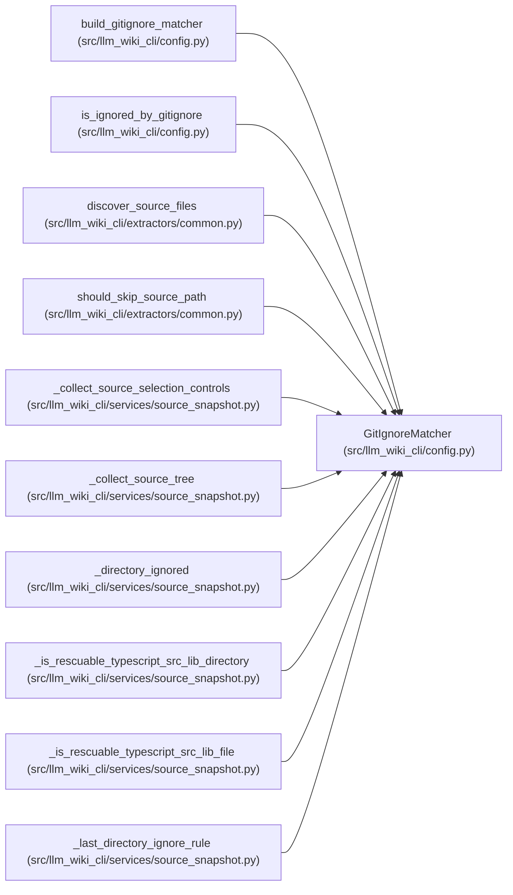

# GitIgnoreMatcher

**Location:** `src/llm_wiki_cli/config.py:323`
**Kind:** Class
**Bases:** —
**Module:** [config](../modules/config.md)

## Description

Ordered gitignore matcher for repository scans.

This supports the semantics the extractors need without reparsing the same
.gitignore file for every source file: negation, root-anchored patterns,
nested .gitignore files, directory-only rules, and common ``**`` patterns.

## Attributes

*No annotated attributes found.*

## Methods

| Method | Signature | Decorators | Description |
|--------|-----------|------------|-------------|
| `__init__` | `(rules: list[_GitignoreRule])` | — | — |
| `last_matching_rule` | `(rel_path: str) -> _GitignoreRule \| None` | — | Return the final gitignore rule that matches *rel_path*, if any. |
| `is_ignored` | `(rel_path: str) -> bool` | — | — |

## Relationships

<!-- Auto-generated relationship summary. Do not edit by hand. -->

### Summary

| Module | Methods | Attributes |
|---|---:|---|
| [config](../modules/config.md) | 3 | — |

### References

| Reference | Kind | Source |
|---|---|---|
| `build_gitignore_matcher` | call | [config](../modules/config.md) |
| `build_gitignore_matcher` | call | [config](../modules/config.md) |
| `build_gitignore_matcher` | type_reference | [config](../modules/config.md) |
| `is_ignored_by_gitignore` | call | [config](../modules/config.md) |
| `discover_source_files` | type_reference | [common](../modules/common.md) |
| `should_skip_source_path` | type_reference | [common](../modules/common.md) |
| `_collect_source_selection_controls` | call | [source_snapshot](../modules/source_snapshot.md) |
| `_collect_source_tree` | call | [source_snapshot](../modules/source_snapshot.md) |
| `_directory_ignored` | type_reference | [source_snapshot](../modules/source_snapshot.md) |
| `_is_rescuable_typescript_src_lib_directory` | type_reference | [source_snapshot](../modules/source_snapshot.md) |
| `_is_rescuable_typescript_src_lib_file` | type_reference | [source_snapshot](../modules/source_snapshot.md) |
| `_last_directory_ignore_rule` | type_reference | [source_snapshot](../modules/source_snapshot.md) |
