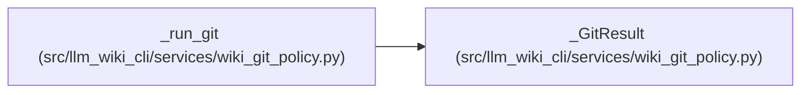

# _GitResult

**Location:** `src/llm_wiki_cli/services/wiki_git_policy.py:67`
**Kind:** Class
**Bases:** —
**Module:** [wiki_git_policy](../modules/wiki_git_policy.md)

**Decorators:** `@dataclass(frozen=True)`

## Description

_Auto-generated from `_GitResult` in `src/llm_wiki_cli/services/wiki_git_policy.py`._

## Attributes

| Name | Type | Default | Description |
|------|------|---------|-------------|
| `returncode` | `int \| None` | *required* | — |
| `stdout` | `str` | `''` | — |
| `failure` | `str \| None` | `None` | — |

## Methods

*No public methods. Inherits from base classes.*

## Relationships

<!-- Auto-generated relationship summary. Do not edit by hand. -->

### Summary

| Module | Methods | Attributes |
|---|---:|---|
| [wiki_git_policy](../modules/wiki_git_policy.md) | 0 | `failure`, `returncode`, `stdout` |

### References

| Reference | Kind | Source |
|---|---|---|
| `_run_git` | call | [wiki_git_policy](../modules/wiki_git_policy.md) |
| `_run_git` | call | [wiki_git_policy](../modules/wiki_git_policy.md) |
| `_run_git` | call | [wiki_git_policy](../modules/wiki_git_policy.md) |
| `_run_git` | call | [wiki_git_policy](../modules/wiki_git_policy.md) |
| `_run_git` | type_reference | [wiki_git_policy](../modules/wiki_git_policy.md) |
