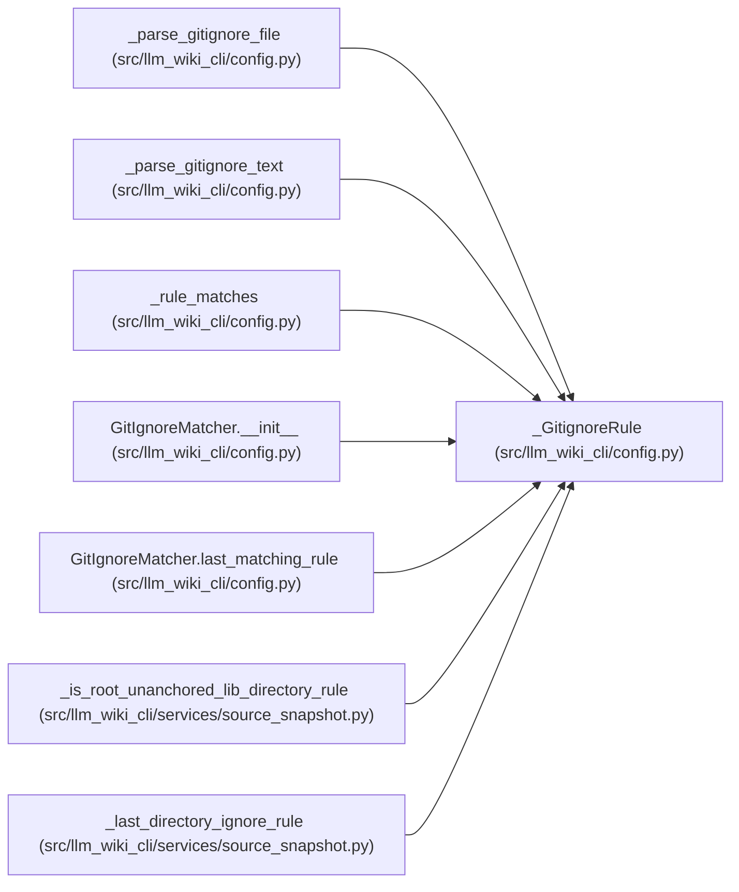

# _GitignoreRule

**Location:** `src/llm_wiki_cli/config.py:373`
**Kind:** Class
**Bases:** —
**Module:** [config](../modules/config.md)

**Decorators:** `@dataclass(frozen=True)`

## Description

_Auto-generated from `_GitignoreRule` in `src/llm_wiki_cli/config.py`._

## Attributes

| Name | Type | Default | Description |
|------|------|---------|-------------|
| `base` | `str` | *required* | — |
| `pattern` | `str` | *required* | — |
| `negated` | `bool` | *required* | — |
| `directory_only` | `bool` | *required* | — |
| `anchored` | `bool` | *required* | — |

## Methods

*No public methods. Inherits from base classes.*

## Relationships

<!-- Auto-generated relationship summary. Do not edit by hand. -->

### Summary

| Module | Methods | Attributes |
|---|---:|---|
| [config](../modules/config.md) | 0 | `anchored`, `base`, `directory_only`, `negated`, `pattern` |

### References

| Reference | Kind | Source | Call sites |
|---|---|---|---:|
| `_parse_gitignore_file` | type_reference | [config](../modules/config.md) | — |
| `_parse_gitignore_text` | call | [config](../modules/config.md) | 1 |
| `_parse_gitignore_text` | type_reference | [config](../modules/config.md) | — |
| `_rule_matches` | type_reference | [config](../modules/config.md) | — |
| `GitIgnoreMatcher.__init__` | type_reference | [config](../modules/config.md) | — |
| `GitIgnoreMatcher.last_matching_rule` | type_reference | [config](../modules/config.md) | — |
| `_is_root_unanchored_lib_directory_rule` | type_reference | [source_snapshot](../modules/source_snapshot.md) | — |
| `_last_directory_ignore_rule` | type_reference | [source_snapshot](../modules/source_snapshot.md) | — |
