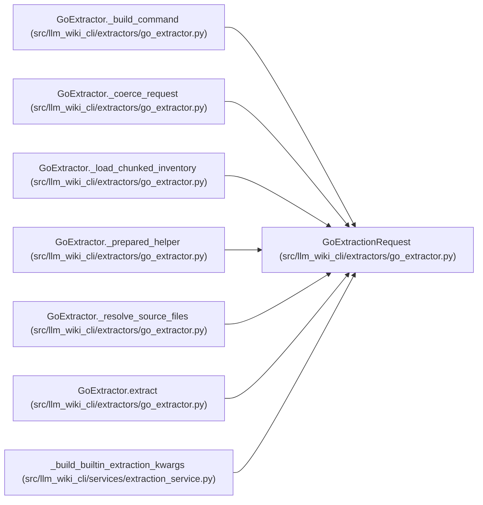

# GoExtractionRequest

**Location:** `src/llm_wiki_cli/extractors/go_extractor.py:38`
**Kind:** Class
**Bases:** —
**Module:** [go_extractor](../modules/go_extractor.md)

**Decorators:** `@dataclass(frozen=True)`

## Description

Internal request object for Go extraction orchestration.

## Attributes

| Name | Type | Default | Description |
|------|------|---------|-------------|
| `src_dir` | `str` | *required* | — |
| `only_files` | `list[str] \| None` | `None` | — |
| `deep` | `bool` | `False` | — |
| `source_files` | `list[str] \| None` | `None` | — |
| `helper_cache_dir` | `str \| None` | `None` | — |
| `include_tests` | `Iterable[str] \| None` | `None` | — |

## Methods

| Method | Signature | Decorators | Description |
|--------|-----------|------------|-------------|
| `__post_init__` | `() -> None` | — | — |

## Relationships

<!-- Auto-generated relationship summary. Do not edit by hand. -->

### Summary

| Module | Methods | Attributes |
|---|---:|---|
| [go_extractor](../modules/go_extractor.md) | 1 | `deep`, `helper_cache_dir`, `include_tests`, `only_files`, `source_files`, `src_dir` |

### References

| Reference | Kind | Source |
|---|---|---|
| `GoExtractor._build_command` | type_reference | [go_extractor](../modules/go_extractor.md) |
| `GoExtractor._coerce_request` | call | [go_extractor](../modules/go_extractor.md) |
| `GoExtractor._coerce_request` | type_reference | [go_extractor](../modules/go_extractor.md) |
| `GoExtractor._load_chunked_inventory` | type_reference | [go_extractor](../modules/go_extractor.md) |
| `GoExtractor._prepared_helper` | type_reference | [go_extractor](../modules/go_extractor.md) |
| `GoExtractor._resolve_source_files` | type_reference | [go_extractor](../modules/go_extractor.md) |
| `GoExtractor.extract` | type_reference | [go_extractor](../modules/go_extractor.md) |
| `_build_builtin_extraction_kwargs` | call | [extraction_service](../modules/extraction_service.md) |
