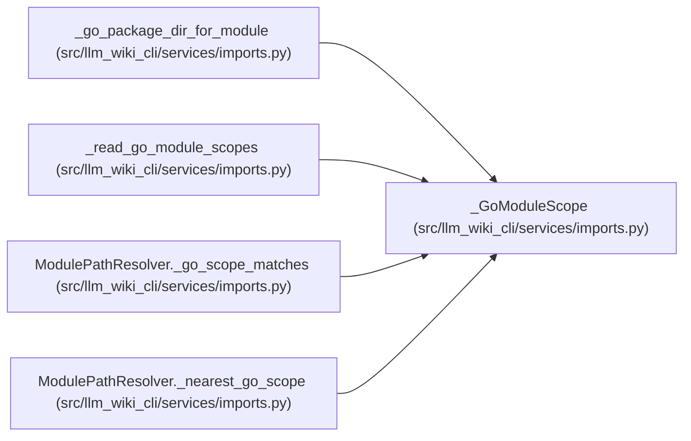

# _GoModuleScope

**Location:** `src/llm_wiki_cli/services/imports.py:33`
**Kind:** Class
**Bases:** —
**Module:** [imports](../modules/imports.md)

**Decorators:** `@dataclass(frozen=True)`

## Description

One ``go.mod`` module declaration scoped to its directory.

## Attributes

| Name | Type | Default | Description |
|------|------|---------|-------------|
| `root` | `str` | *required* | — |
| `module` | `str` | *required* | — |

## Methods

*No public methods. Inherits from base classes.*

## Relationships

<!-- Auto-generated relationship summary. Do not edit by hand. -->

### Summary

| Module | Methods | Attributes |
|---|---:|---|
| [imports](../modules/imports.md) | 0 | `module`, `root` |

### References

| Reference | Kind | Source | Call sites |
|---|---|---|---:|
| `_go_package_dir_for_module` | type_reference | [imports](../modules/imports.md) | — |
| `_read_go_module_scopes` | call | [imports](../modules/imports.md) | 1 |
| `_read_go_module_scopes` | type_reference | [imports](../modules/imports.md) | — |
| `ModulePathResolver._go_scope_matches` | type_reference | [imports](../modules/imports.md) | — |
| `ModulePathResolver._nearest_go_scope` | type_reference | [imports](../modules/imports.md) | — |
