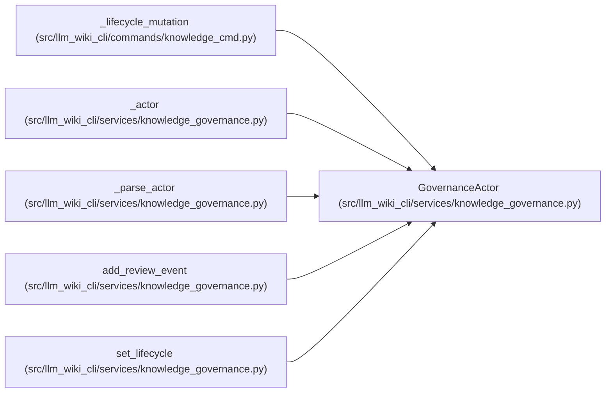

# GovernanceActor

**Location:** `src/llm_wiki_cli/services/knowledge_governance.py:143`
**Kind:** Class
**Bases:** —
**Module:** [knowledge_governance](../modules/knowledge_governance.md)

**Decorators:** `@dataclass(frozen=True)`

## Description

Explicit event author; never inferred from Git metadata.

## Attributes

| Name | Type | Default | Description |
|------|------|---------|-------------|
| `kind` | `str` | *required* | — |
| `actor_id` | `str` | *required* | — |

## Methods

| Method | Signature | Decorators | Description |
|--------|-----------|------------|-------------|
| `to_payload` | `() -> dict[str, str]` | — | — |

## Relationships

<!-- Auto-generated relationship summary. Do not edit by hand. -->

### Summary

| Module | Methods | Attributes |
|---|---:|---|
| [knowledge_governance](../modules/knowledge_governance.md) | 1 | `actor_id`, `kind` |

### References

| Reference | Kind | Source | Call sites |
|---|---|---|---:|
| `_lifecycle_mutation` | call | [knowledge_cmd](../modules/knowledge_cmd.md) | 1 |
| `_actor` | call | [knowledge_governance](../modules/knowledge_governance.md) | 1 |
| `_actor` | type_reference | [knowledge_governance](../modules/knowledge_governance.md) | — |
| `_parse_actor` | call | [knowledge_governance](../modules/knowledge_governance.md) | 1 |
| `_parse_actor` | type_reference | [knowledge_governance](../modules/knowledge_governance.md) | — |
| `add_review_event` | type_reference | [knowledge_governance](../modules/knowledge_governance.md) | — |
| `set_lifecycle` | type_reference | [knowledge_governance](../modules/knowledge_governance.md) | — |
