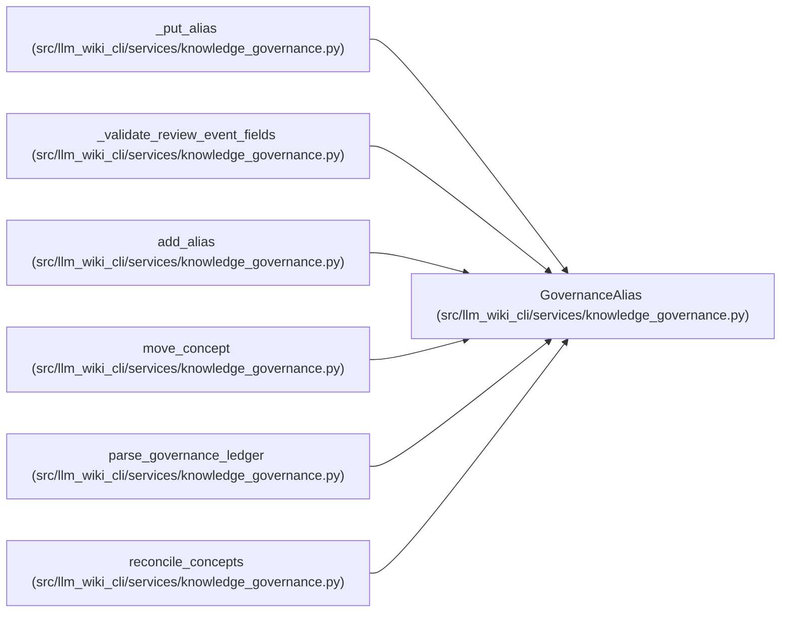

# GovernanceAlias

**Location:** `src/llm_wiki_cli/services/knowledge_governance.py:171`
**Kind:** Class
**Bases:** —
**Module:** [knowledge_governance](../modules/knowledge_governance.md)

**Decorators:** `@dataclass(frozen=True)`

## Description

A historical locator or natural key owned by one UID.

## Attributes

| Name | Type | Default | Description |
|------|------|---------|-------------|
| `uid` | `str` | *required* | — |
| `alias_type` | `str` | *required* | — |
| `value` | `str` | *required* | — |

## Methods

| Method | Signature | Decorators | Description |
|--------|-----------|------------|-------------|
| `key` | `() -> str` | `@property` | — |
| `to_payload` | `() -> dict[str, str]` | — | — |

## Relationships

<!-- Auto-generated relationship summary. Do not edit by hand. -->

### Summary

| Module | Methods | Attributes |
|---|---:|---|
| [knowledge_governance](../modules/knowledge_governance.md) | 2 | `alias_type`, `uid`, `value` |

### References

| Reference | Kind | Source |
|---|---|---|
| `_put_alias` | type_reference | [knowledge_governance](../modules/knowledge_governance.md) |
| `_validate_review_event_fields` | type_reference | [knowledge_governance](../modules/knowledge_governance.md) |
| `add_alias` | call | [knowledge_governance](../modules/knowledge_governance.md) |
| `move_concept` | call | [knowledge_governance](../modules/knowledge_governance.md) |
| `move_concept` | call | [knowledge_governance](../modules/knowledge_governance.md) |
| `parse_governance_ledger` | call | [knowledge_governance](../modules/knowledge_governance.md) |
| `reconcile_concepts` | call | [knowledge_governance](../modules/knowledge_governance.md) |
| `reconcile_concepts` | call | [knowledge_governance](../modules/knowledge_governance.md) |
