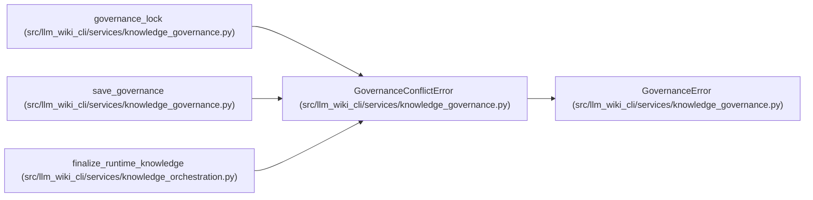

# GovernanceConflictError

**Location:** `src/llm_wiki_cli/services/knowledge_governance.py:127`
**Kind:** Class
**Bases:** `GovernanceError`
**Module:** [knowledge_governance](../modules/knowledge_governance.md)

## Description

Raised when optimistic concurrency detects a changed ledger.

## Attributes

*No annotated attributes found.*

## Methods

| Method | Signature | Decorators | Description |
|--------|-----------|------------|-------------|
| `__init__` | `(field: str, message: str)` | — | — |

## Relationships

<!-- Auto-generated relationship summary. Do not edit by hand. -->

### Summary

| Module | Methods | Attributes |
|---|---:|---|
| [knowledge_governance](../modules/knowledge_governance.md) | 1 | — |

### Structure

| Kind | Entity | Module |
|---|---|---|
| Base | `GovernanceError` | [knowledge_governance](../modules/knowledge_governance.md) |

### References

| Reference | Kind | Source | Call sites |
|---|---|---|---:|
| `governance_lock` | call | [knowledge_governance](../modules/knowledge_governance.md) | 1 |
| `save_governance` | call | [knowledge_governance](../modules/knowledge_governance.md) | 1 |
| `finalize_runtime_knowledge` | call | [knowledge_orchestration](../modules/knowledge_orchestration.md) | 2 |
