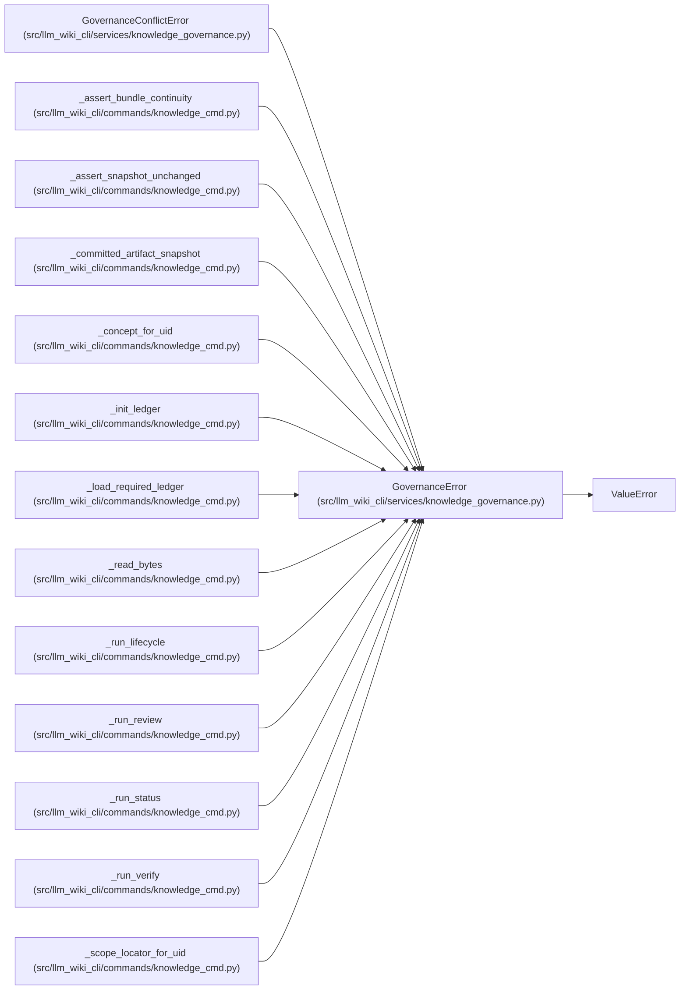

# GovernanceError

**Location:** `src/llm_wiki_cli/services/knowledge_governance.py:111`
**Kind:** Class
**Bases:** `ValueError`
**Module:** [knowledge_governance](../modules/knowledge_governance.md)

## Description

A field-specific governance validation or mutation failure.

## Attributes

*No annotated attributes found.*

## Methods

| Method | Signature | Decorators | Description |
|--------|-----------|------------|-------------|
| `__init__` | `(field: str, message: str, *, code: str = 'governance-invalid')` | — | — |

## Relationships

<!-- Auto-generated relationship summary. Do not edit by hand. -->

### Summary

| Module | Methods | Attributes |
|---|---:|---|
| [knowledge_governance](../modules/knowledge_governance.md) | 1 | — |

### Structure

| Kind | Entity | Module |
|---|---|---|
| Base | `ValueError` | — |
| Subclass | `GovernanceConflictError` | [knowledge_governance](../modules/knowledge_governance.md) |

### References

| Reference | Kind | Source | Call sites |
|---|---|---|---:|
| `_assert_bundle_continuity` | call | [knowledge_cmd](../modules/knowledge_cmd.md) | 1 |
| `_assert_snapshot_unchanged` | call | [knowledge_cmd](../modules/knowledge_cmd.md) | 1 |
| `_committed_artifact_snapshot` | call | [knowledge_cmd](../modules/knowledge_cmd.md) | 2 |
| `_concept_for_uid` | call | [knowledge_cmd](../modules/knowledge_cmd.md) | 2 |
| `_init_ledger` | call | [knowledge_cmd](../modules/knowledge_cmd.md) | 1 |
| `_load_required_ledger` | call | [knowledge_cmd](../modules/knowledge_cmd.md) | 1 |
| `_read_bytes` | call | [knowledge_cmd](../modules/knowledge_cmd.md) | 3 |
| `_run_lifecycle` | call | [knowledge_cmd](../modules/knowledge_cmd.md) | 1 |
| `_run_review` | call | [knowledge_cmd](../modules/knowledge_cmd.md) | 1 |
| `_run_status` | call | [knowledge_cmd](../modules/knowledge_cmd.md) | 2 |
| `_run_verify` | call | [knowledge_cmd](../modules/knowledge_cmd.md) | 1 |
| `_scope_locator_for_uid` | call | [knowledge_cmd](../modules/knowledge_cmd.md) | 1 |

> References: showing 12 of 73 logical references; 61 omitted by the 12-row generated summary limit.
