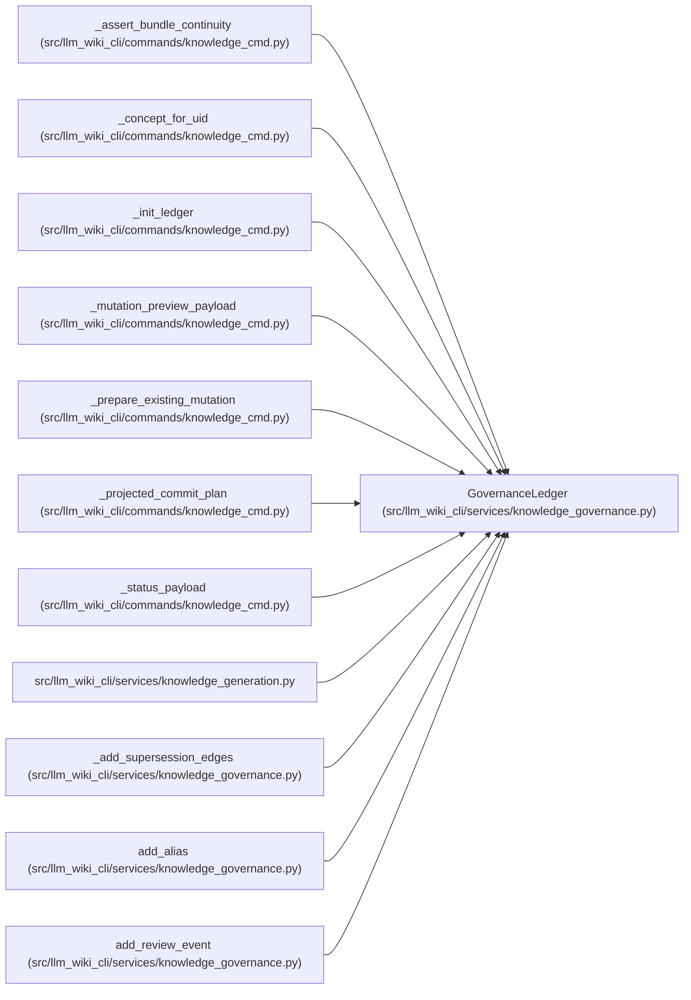

# GovernanceLedger

**Location:** `src/llm_wiki_cli/services/knowledge_governance.py:264`
**Kind:** Class
**Bases:** —
**Module:** [knowledge_governance](../modules/knowledge_governance.md)

**Decorators:** `@dataclass(frozen=True)`

## Description

Validated non-rebuildable governance authority.

## Attributes

| Name | Type | Default | Description |
|------|------|---------|-------------|
| `bundle_id` | `str` | *required* | — |
| `concepts` | `Mapping[str, GovernanceAllocation]` | `field(default_factory=dict)` | — |
| `aliases` | `Mapping[str, GovernanceAlias]` | `field(default_factory=dict)` | — |
| `lifecycle_events` | `Mapping[str, LifecycleEvent]` | `field(default_factory=dict)` | — |
| `review_events` | `Mapping[str, ReviewEvent]` | `field(default_factory=dict)` | — |
| `schema_version` | `str` | `GOVERNANCE_SCHEMA_VERSION` | — |

## Methods

| Method | Signature | Decorators | Description |
|--------|-----------|------------|-------------|
| `empty` | `(bundle_id: str \| None = None) -> 'GovernanceLedger'` | `@classmethod` | — |
| `from_payload` | `(payload: object, *, expected_bundle_id: str \| None = None) -> 'GovernanceLedger'` | `@classmethod` | — |
| `to_payload` | `() -> dict[str, object]` | — | — |
| `to_bytes` | `() -> bytes` | — | — |
| `content_hash` | `() -> str` | — | — |

## Relationships

<!-- Auto-generated relationship summary. Do not edit by hand. -->

### Summary

| Module | Methods | Attributes |
|---|---:|---|
| [knowledge_governance](../modules/knowledge_governance.md) | 5 | `aliases`, `bundle_id`, `concepts`, `lifecycle_events`, `review_events`, `schema_version` |

### References

| Reference | Kind | Source |
|---|---|---|
| `_assert_bundle_continuity` | type_reference | [knowledge_cmd](../modules/knowledge_cmd.md) |
| `_concept_for_uid` | type_reference | [knowledge_cmd](../modules/knowledge_cmd.md) |
| `_init_ledger` | call | [knowledge_cmd](../modules/knowledge_cmd.md) |
| `_init_ledger` | type_reference | [knowledge_cmd](../modules/knowledge_cmd.md) |
| `_mutation_preview_payload` | type_reference | [knowledge_cmd](../modules/knowledge_cmd.md) |
| `_prepare_existing_mutation` | type_reference | [knowledge_cmd](../modules/knowledge_cmd.md) |
| `_projected_commit_plan` | type_reference | [knowledge_cmd](../modules/knowledge_cmd.md) |
| `_status_payload` | type_reference | [knowledge_cmd](../modules/knowledge_cmd.md) |
| `knowledge_generation` | import | [knowledge_generation](../modules/knowledge_generation.md) |
| `_add_supersession_edges` | type_reference | [knowledge_governance](../modules/knowledge_governance.md) |
| `add_alias` | type_reference | [knowledge_governance](../modules/knowledge_governance.md) |
| `add_review_event` | type_reference | [knowledge_governance](../modules/knowledge_governance.md) |
