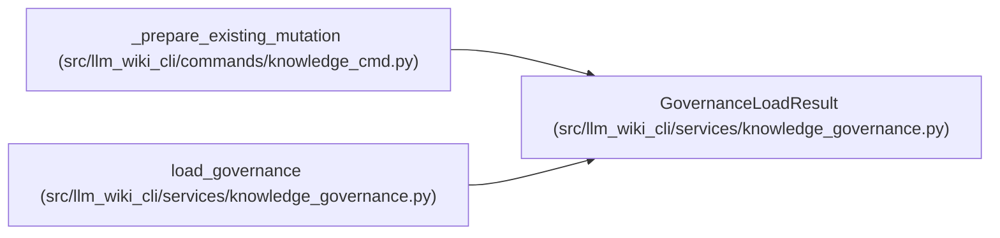

# GovernanceLoadResult

**Location:** `src/llm_wiki_cli/services/knowledge_governance.py:322`
**Kind:** Class
**Bases:** —
**Module:** [knowledge_governance](../modules/knowledge_governance.md)

**Decorators:** `@dataclass(frozen=True)`

## Description

_Auto-generated from `GovernanceLoadResult` in `src/llm_wiki_cli/services/knowledge_governance.py`._

## Attributes

| Name | Type | Default | Description |
|------|------|---------|-------------|
| `ledger` | `GovernanceLedger` | *required* | — |
| `content_hash` | `str` | *required* | — |
| `content` | `bytes` | *required* | — |

## Methods

*No public methods. Inherits from base classes.*

## Relationships

<!-- Auto-generated relationship summary. Do not edit by hand. -->

### Summary

| Module | Methods | Attributes |
|---|---:|---|
| [knowledge_governance](../modules/knowledge_governance.md) | 0 | `content`, `content_hash`, `ledger` |

### References

| Reference | Kind | Source |
|---|---|---|
| `_prepare_existing_mutation` | type_reference | [knowledge_cmd](../modules/knowledge_cmd.md) |
| `load_governance` | call | [knowledge_governance](../modules/knowledge_governance.md) |
| `load_governance` | type_reference | [knowledge_governance](../modules/knowledge_governance.md) |
