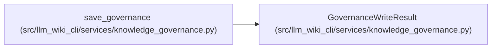

# GovernanceWriteResult

**Location:** `src/llm_wiki_cli/services/knowledge_governance.py:329`
**Kind:** Class
**Bases:** —
**Module:** [knowledge_governance](../modules/knowledge_governance.md)

**Decorators:** `@dataclass(frozen=True)`

## Description

_Auto-generated from `GovernanceWriteResult` in `src/llm_wiki_cli/services/knowledge_governance.py`._

## Attributes

| Name | Type | Default | Description |
|------|------|---------|-------------|
| `path` | `Path` | *required* | — |
| `previous_hash` | `str \| None` | *required* | — |
| `content_hash` | `str` | *required* | — |
| `changed` | `bool` | *required* | — |

## Methods

*No public methods. Inherits from base classes.*

## Relationships

<!-- Auto-generated relationship summary. Do not edit by hand. -->

### Summary

| Module | Methods | Attributes |
|---|---:|---|
| [knowledge_governance](../modules/knowledge_governance.md) | 0 | `changed`, `content_hash`, `path`, `previous_hash` |

### References

| Reference | Kind | Source | Call sites |
|---|---|---|---:|
| `save_governance` | call | [knowledge_governance](../modules/knowledge_governance.md) | 2 |
| `save_governance` | type_reference | [knowledge_governance](../modules/knowledge_governance.md) | — |
