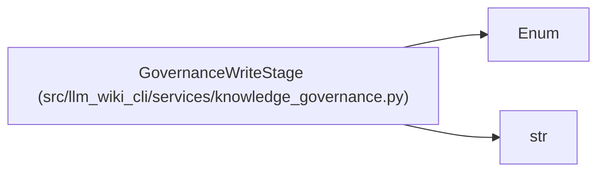

# GovernanceWriteStage

**Location:** `src/llm_wiki_cli/services/knowledge_governance.py:134`
**Kind:** Enum
**Bases:** `str`, `Enum`
**Module:** [knowledge_governance](../modules/knowledge_governance.md)

## Description

Fault-injection points for the durable ledger replacement.

## Attributes

| Name | Declared value | Description |
|------|-------|-------------|
| `TEMP_DURABLE` | `'temp-durable'` | — |
| `REPLACED` | `'replaced'` | — |
| `DIRECTORY_DURABLE` | `'directory-durable'` | — |

## Methods

*No public methods. Inherits from base classes.*

## Relationships

<!-- Auto-generated relationship summary. Do not edit by hand. -->

### Summary

| Module | Methods | Attributes |
|---|---:|---|
| [knowledge_governance](../modules/knowledge_governance.md) | 0 | `DIRECTORY_DURABLE`, `REPLACED`, `TEMP_DURABLE` |

### Structure

| Kind | Entity | Module |
|---|---|---|
| Base | `Enum` | — |
| Base | `str` | — |
