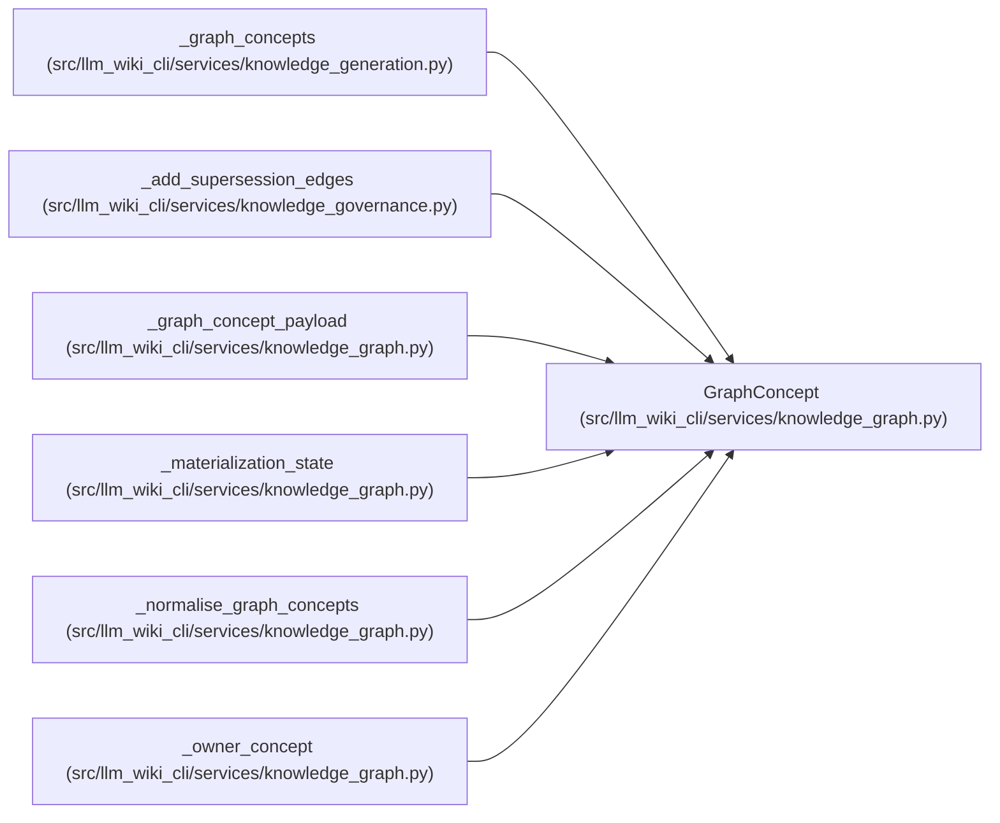

# GraphConcept

**Location:** `src/llm_wiki_cli/services/knowledge_graph.py:119`
**Kind:** Class
**Bases:** —
**Module:** [knowledge_graph](../modules/knowledge_graph.md)

**Decorators:** `@dataclass(frozen=True)`

## Description

One already-built concept coordinate used for endpoint lifting.

## Attributes

| Name | Type | Default | Description |
|------|------|---------|-------------|
| `locator` | `str` | *required* | — |
| `concept_kind` | `str` | *required* | — |
| `source_path` | `str \| None` | `None` | — |
| `symbol` | `str \| None` | `None` | — |
| `occurrence` | `int \| None` | `None` | — |
| `page_id` | `str \| None` | `None` | — |

## Methods

*No public methods. Inherits from base classes.*

## Relationships

<!-- Auto-generated relationship summary. Do not edit by hand. -->

### Summary

| Module | Methods | Attributes |
|---|---:|---|
| [knowledge_graph](../modules/knowledge_graph.md) | 0 | `concept_kind`, `locator`, `occurrence`, `page_id`, `source_path`, `symbol` |

### References

| Reference | Kind | Source | Call sites |
|---|---|---|---:|
| `_graph_concepts` | call | [knowledge_generation](../modules/knowledge_generation.md) | 1 |
| `_graph_concepts` | type_reference | [knowledge_generation](../modules/knowledge_generation.md) | — |
| `_add_supersession_edges` | call | [knowledge_governance](../modules/knowledge_governance.md) | 1 |
| `_graph_concept_payload` | type_reference | [knowledge_graph](../modules/knowledge_graph.md) | — |
| `_materialization_state` | type_reference | [knowledge_graph](../modules/knowledge_graph.md) | — |
| `_normalise_graph_concepts` | call | [knowledge_graph](../modules/knowledge_graph.md) | 1 |
| `_normalise_graph_concepts` | type_reference | [knowledge_graph](../modules/knowledge_graph.md) | — |
| `_owner_concept` | type_reference | [knowledge_graph](../modules/knowledge_graph.md) | — |
