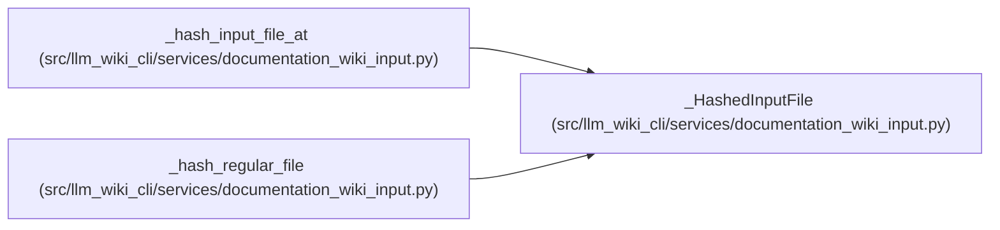

# _HashedInputFile

**Location:** `src/llm_wiki_cli/services/documentation_wiki_input.py:364`
**Kind:** Class
**Bases:** —
**Module:** [documentation_wiki_input](../modules/documentation_wiki_input.md)

**Decorators:** `@dataclass(frozen=True)`

## Description

_Auto-generated from `_HashedInputFile` in `src/llm_wiki_cli/services/documentation_wiki_input.py`._

## Attributes

| Name | Type | Default | Description |
|------|------|---------|-------------|
| `sha256` | `str` | *required* | — |
| `opened_stat` | `os.stat_result` | *required* | — |

## Methods

*No public methods. Inherits from base classes.*

## Relationships

<!-- Auto-generated relationship summary. Do not edit by hand. -->

### Summary

| Module | Methods | Attributes |
|---|---:|---|
| [documentation_wiki_input](../modules/documentation_wiki_input.md) | 0 | `opened_stat`, `sha256` |

### References

| Reference | Kind | Source | Call sites |
|---|---|---|---:|
| `_hash_input_file_at` | call | [documentation_wiki_input](../modules/documentation_wiki_input.md) | 1 |
| `_hash_input_file_at` | type_reference | [documentation_wiki_input](../modules/documentation_wiki_input.md) | — |
| `_hash_regular_file` | call | [documentation_wiki_input](../modules/documentation_wiki_input.md) | 1 |
| `_hash_regular_file` | type_reference | [documentation_wiki_input](../modules/documentation_wiki_input.md) | — |
