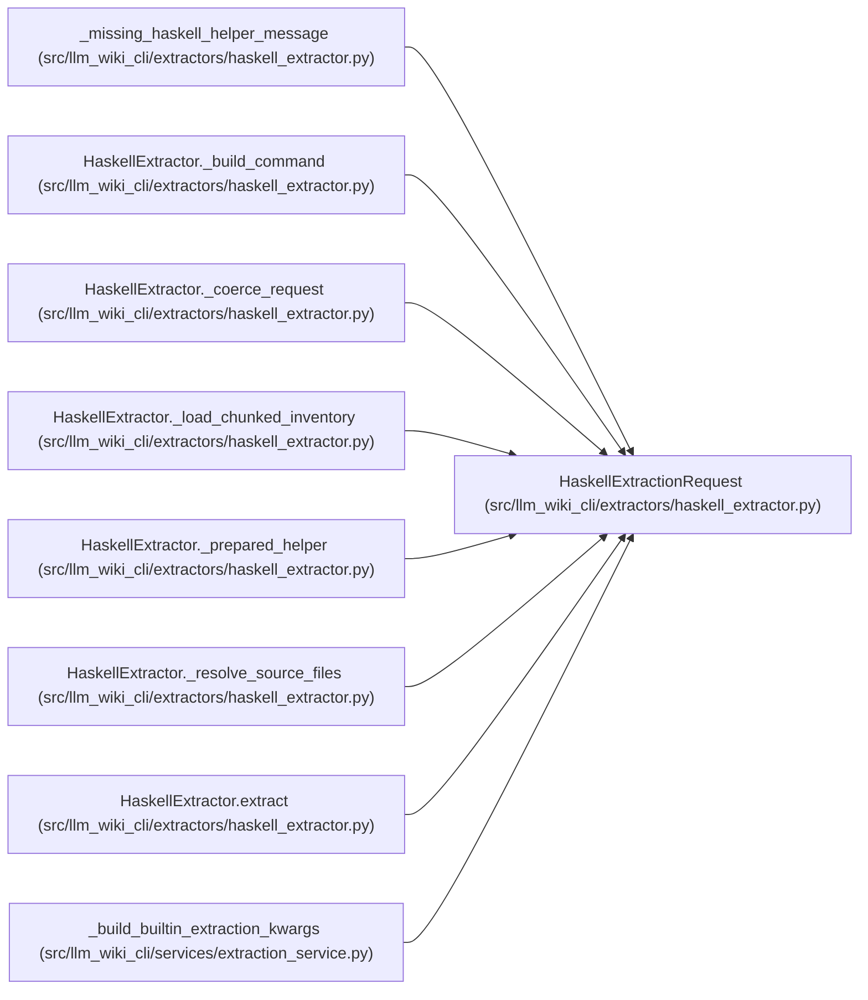

# HaskellExtractionRequest

**Location:** `src/llm_wiki_cli/extractors/haskell_extractor.py:26`
**Kind:** Class
**Bases:** —
**Module:** [haskell_extractor](../modules/haskell_extractor.md)

**Decorators:** `@dataclass(frozen=True)`

## Description

Internal request object for Haskell extraction orchestration.

## Attributes

| Name | Type | Default | Description |
|------|------|---------|-------------|
| `src_dir` | `str` | *required* | — |
| `only_files` | `list[str] \| None` | `None` | — |
| `deep` | `bool` | `False` | — |
| `source_files` | `list[str] \| None` | `None` | — |
| `helper_cache_dir` | `str \| None` | `None` | — |

## Methods

*No public methods. Inherits from base classes.*

## Relationships

<!-- Auto-generated relationship summary. Do not edit by hand. -->

### Summary

| Module | Methods | Attributes |
|---|---:|---|
| [haskell_extractor](../modules/haskell_extractor.md) | 0 | `deep`, `helper_cache_dir`, `only_files`, `source_files`, `src_dir` |

### References

| Reference | Kind | Source |
|---|---|---|
| `_missing_haskell_helper_message` | type_reference | [haskell_extractor](../modules/haskell_extractor.md) |
| `HaskellExtractor._build_command` | type_reference | [haskell_extractor](../modules/haskell_extractor.md) |
| `HaskellExtractor._coerce_request` | call | [haskell_extractor](../modules/haskell_extractor.md) |
| `HaskellExtractor._coerce_request` | type_reference | [haskell_extractor](../modules/haskell_extractor.md) |
| `HaskellExtractor._load_chunked_inventory` | type_reference | [haskell_extractor](../modules/haskell_extractor.md) |
| `HaskellExtractor._prepared_helper` | type_reference | [haskell_extractor](../modules/haskell_extractor.md) |
| `HaskellExtractor._resolve_source_files` | type_reference | [haskell_extractor](../modules/haskell_extractor.md) |
| `HaskellExtractor.extract` | type_reference | [haskell_extractor](../modules/haskell_extractor.md) |
| `_build_builtin_extraction_kwargs` | call | [extraction_service](../modules/extraction_service.md) |
