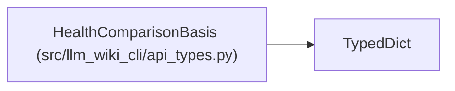

# HealthComparisonBasis

**Location:** `src/llm_wiki_cli/api_types.py:541`
**Kind:** Class
**Bases:** `TypedDict`
**Module:** [api_types](../modules/api_types.md)

## Description

_Auto-generated from `HealthComparisonBasis` in `src/llm_wiki_cli/api_types.py`._

## Attributes

| Name | Type | Presence | Description |
|------|------|----------|-------------|
| `policy` | `str` | *required* | — |
| `analysis_contract` | `str \| None` | *required* | — |
| `recorded` | `HealthProducer \| None` | *required* | — |
| `live` | `HealthProducer \| None` | *required* | — |

## Methods

*No public methods. Inherits from base classes.*

## Relationships

<!-- Auto-generated relationship summary. Do not edit by hand. -->

### Summary

| Module | Methods | Attributes |
|---|---:|---|
| [api_types](../modules/api_types.md) | 0 | `analysis_contract`, `live`, `policy`, `recorded` |

### Structure

| Kind | Entity | Module |
|---|---|---|
| Base | `TypedDict` | — |
