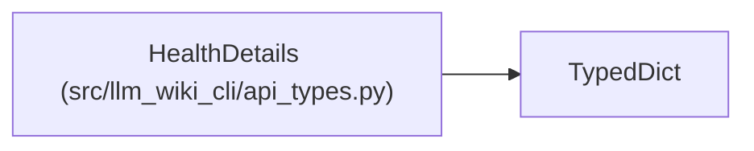

# HealthDetails

**Location:** `src/llm_wiki_cli/api_types.py:565`
**Kind:** Class
**Bases:** `TypedDict`
**Module:** [api_types](../modules/api_types.md)

## Description

_Auto-generated from `HealthDetails` in `src/llm_wiki_cli/api_types.py`._

## Attributes

| Name | Type | Presence | Description |
|------|------|----------|-------------|
| `schema_version` | `str` | *required* | — |
| `scope` | `HealthScope` | *required* | — |
| `evaluation` | `HealthEvaluation` | *required* | — |
| `snapshot` | `HealthSnapshot` | *required* | — |
| `basis` | `HealthComparisonBasis` | *required* | — |
| `coverage` | `HealthCoverage` | *required* | — |
| `reasons` | `list[HealthReason]` | *required* | — |

## Methods

*No public methods. Inherits from base classes.*

## Relationships

<!-- Auto-generated relationship summary. Do not edit by hand. -->

### Summary

| Module | Methods | Attributes |
|---|---:|---|
| [api_types](../modules/api_types.md) | 0 | `basis`, `coverage`, `evaluation`, `reasons`, `schema_version`, `scope`, `snapshot` |

### Structure

| Kind | Entity | Module |
|---|---|---|
| Base | `TypedDict` | — |
