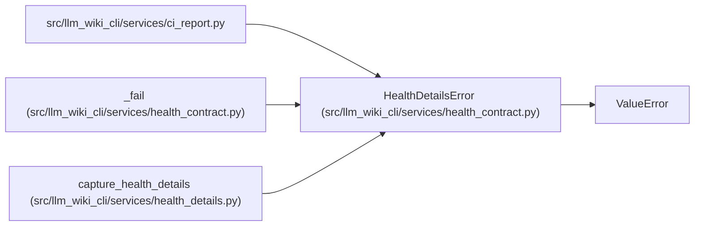

# HealthDetailsError

**Location:** `src/llm_wiki_cli/services/health_contract.py:38`
**Kind:** Class
**Bases:** `ValueError`
**Module:** [health_contract](../modules/health_contract.md)

## Description

Detailed health data is incomplete, unsupported or inconsistent.

## Attributes

*No annotated attributes found.*

## Methods

*No public methods. Inherits from base classes.*

## Relationships

<!-- Auto-generated relationship summary. Do not edit by hand. -->

### Summary

| Module | Methods | Attributes |
|---|---:|---|
| [health_contract](../modules/health_contract.md) | 0 | — |

### Structure

| Kind | Entity | Module |
|---|---|---|
| Base | `ValueError` | — |

### References

| Reference | Kind | Source | Call sites |
|---|---|---|---:|
| `ci_report` | import | [ci_report](../modules/ci_report.md) | — |
| `_fail` | call | [health_contract](../modules/health_contract.md) | 1 |
| `capture_health_details` | call | [health_details](../modules/health_details.md) | 2 |
