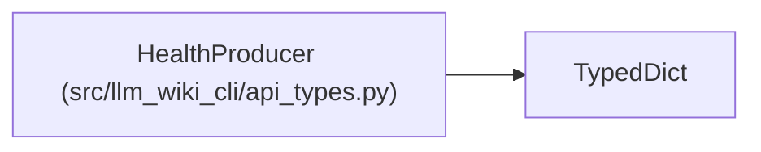

# HealthProducer

**Location:** `src/llm_wiki_cli/api_types.py:533`
**Kind:** Class
**Bases:** `TypedDict`
**Module:** [api_types](../modules/api_types.md)

## Description

_Auto-generated from `HealthProducer` in `src/llm_wiki_cli/api_types.py`._

## Attributes

| Name | Type | Presence | Description |
|------|------|----------|-------------|
| `knowledge_schema_version` | `str` | *required* | — |
| `generation_options_hash` | `str` | *required* | — |
| `tool` | `HealthComponent` | *required* | — |
| `extractors` | `list[HealthComponent]` | *required* | — |
| `plugins` | `list[HealthComponent]` | *required* | — |

## Methods

*No public methods. Inherits from base classes.*

## Relationships

<!-- Auto-generated relationship summary. Do not edit by hand. -->

### Summary

| Module | Methods | Attributes |
|---|---:|---|
| [api_types](../modules/api_types.md) | 0 | `extractors`, `generation_options_hash`, `knowledge_schema_version`, `plugins`, `tool` |

### Structure

| Kind | Entity | Module |
|---|---|---|
| Base | `TypedDict` | — |
