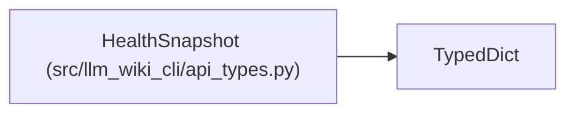

# HealthSnapshot

**Location:** `src/llm_wiki_cli/api_types.py:516`
**Kind:** Class
**Bases:** `TypedDict`
**Module:** [api_types](../modules/api_types.md)

## Description

_Auto-generated from `HealthSnapshot` in `src/llm_wiki_cli/api_types.py`._

## Attributes

| Name | Type | Presence | Description |
|------|------|----------|-------------|
| `validated` | `bool` | *required* | — |
| `knowledge_index_hash` | `str \| None` | *required* | — |
| `evaluated_envelope_hash` | `str \| None` | *required* | — |
| `surface_index_hash` | `str \| None` | *required* | — |
| `recorded_source_hash` | `str \| None` | *required* | — |
| `recorded_markdown_hash` | `str \| None` | *required* | — |
| `live_source_hash` | `str \| None` | *required* | — |

## Methods

*No public methods. Inherits from base classes.*

## Relationships

<!-- Auto-generated relationship summary. Do not edit by hand. -->

### Summary

| Module | Methods | Attributes |
|---|---:|---|
| [api_types](../modules/api_types.md) | 0 | `evaluated_envelope_hash`, `knowledge_index_hash`, `live_source_hash`, `recorded_markdown_hash`, `recorded_source_hash`, `surface_index_hash`, `validated` |

### Structure

| Kind | Entity | Module |
|---|---|---|
| Base | `TypedDict` | — |
