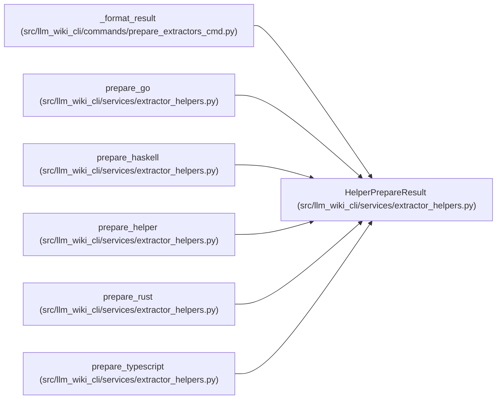

# HelperPrepareResult

**Location:** `src/llm_wiki_cli/services/extractor_helpers.py:43`
**Kind:** Class
**Bases:** —
**Module:** [extractor_helpers](../modules/extractor_helpers.md)

**Decorators:** `@dataclass(frozen=True)`

## Description

_Auto-generated from `HelperPrepareResult` in `src/llm_wiki_cli/services/extractor_helpers.py`._

## Attributes

| Name | Type | Default | Description |
|------|------|---------|-------------|
| `language` | `str` | *required* | — |
| `status` | `str` | *required* | — |
| `message` | `str` | *required* | — |
| `path` | `str \| None` | `None` | — |

## Methods

*No public methods. Inherits from base classes.*

## Relationships

<!-- Auto-generated relationship summary. Do not edit by hand. -->

### Summary

| Module | Methods | Attributes |
|---|---:|---|
| [extractor_helpers](../modules/extractor_helpers.md) | 0 | `language`, `message`, `path`, `status` |

### References

| Reference | Kind | Source | Call sites |
|---|---|---|---:|
| `_format_result` | type_reference | [prepare_extractors_cmd](../modules/prepare_extractors_cmd.md) | — |
| `prepare_go` | call | [extractor_helpers](../modules/extractor_helpers.md) | 8 |
| `prepare_go` | type_reference | [extractor_helpers](../modules/extractor_helpers.md) | — |
| `prepare_haskell` | call | [extractor_helpers](../modules/extractor_helpers.md) | 9 |
| `prepare_haskell` | type_reference | [extractor_helpers](../modules/extractor_helpers.md) | — |
| `prepare_helper` | call | [extractor_helpers](../modules/extractor_helpers.md) | 1 |
| `prepare_helper` | type_reference | [extractor_helpers](../modules/extractor_helpers.md) | — |
| `prepare_rust` | call | [extractor_helpers](../modules/extractor_helpers.md) | 6 |
| `prepare_rust` | type_reference | [extractor_helpers](../modules/extractor_helpers.md) | — |
| `prepare_typescript` | call | [extractor_helpers](../modules/extractor_helpers.md) | 9 |
| `prepare_typescript` | type_reference | [extractor_helpers](../modules/extractor_helpers.md) | — |
