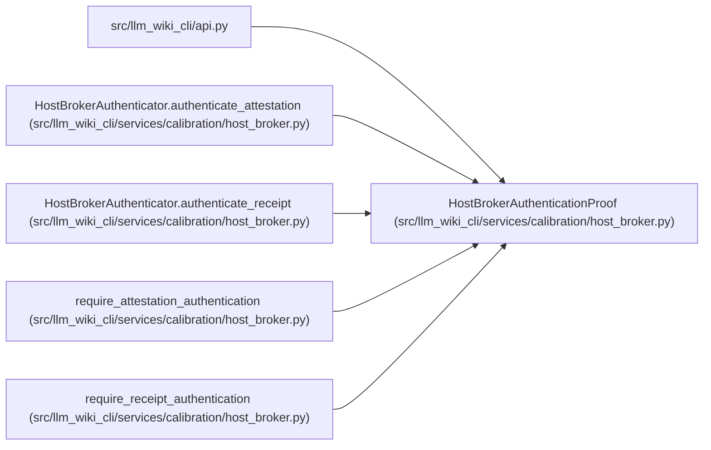

# HostBrokerAuthenticationProof

**Location:** `src/llm_wiki_cli/services/calibration/host_broker.py:32`
**Kind:** Class
**Bases:** —
**Module:** [host_broker](../modules/host_broker.md)

**Decorators:** `@dataclass(frozen=True)`

## Description

Secret-free proof returned by a separately authenticated host broker.

## Attributes

| Name | Type | Default | Description |
|------|------|---------|-------------|
| `proof_kind` | `Literal['attestation', 'receipt']` | *required* | — |
| `authenticator_id` | `str` | *required* | — |
| `broker_id` | `str` | *required* | — |
| `broker_session` | `str` | *required* | — |
| `principal` | `str` | *required* | — |
| `reference` | `str` | *required* | — |
| `cohort_id` | `str` | *required* | — |
| `expires_at` | `str` | *required* | — |
| `authority_hash` | `str` | *required* | — |
| `execution_manifest_hash` | `str` | *required* | — |
| `evidence_bundle_hash` | `str` | *required* | — |
| `attestation_hash` | `str` | *required* | — |
| `receipt_hash` | `str \| None` | `None` | — |
| `result_hash` | `str \| None` | `None` | — |
| `packet_hash` | `str \| None` | `None` | — |
| `idempotency_key` | `str \| None` | `None` | — |
| `route_id` | `str \| None` | `None` | — |
| `role` | `str \| None` | `None` | — |
| `attempt` | `int \| None` | `None` | — |

## Methods

| Method | Signature | Decorators | Description |
|--------|-----------|------------|-------------|
| `__post_init__` | `() -> None` | — | — |
| `to_dict` | `() -> dict[str, Any]` | — | Return bounded, secret-free proof evidence for protected storage. |

## Relationships

<!-- Auto-generated relationship summary. Do not edit by hand. -->

### Summary

| Module | Methods | Attributes |
|---|---:|---|
| [host_broker](../modules/host_broker.md) | 2 | `attempt`, `attestation_hash`, `authenticator_id`, `authority_hash`, `broker_id`, `broker_session`, `cohort_id`, `evidence_bundle_hash`, `execution_manifest_hash`, `expires_at`, `idempotency_key`, `packet_hash` |

### References

| Reference | Kind | Source | Call sites |
|---|---|---|---:|
| `api` | import | [api](../modules/api.md) | — |
| `HostBrokerAuthenticator.authenticate_attestation` | type_reference | [host_broker](../modules/host_broker.md) | — |
| `HostBrokerAuthenticator.authenticate_receipt` | type_reference | [host_broker](../modules/host_broker.md) | — |
| `require_attestation_authentication` | type_reference | [host_broker](../modules/host_broker.md) | — |
| `require_receipt_authentication` | type_reference | [host_broker](../modules/host_broker.md) | — |
