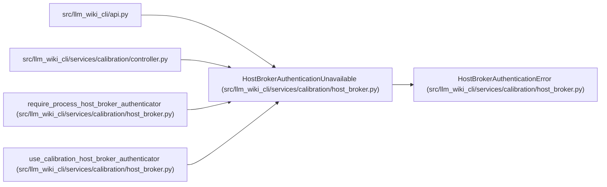

# HostBrokerAuthenticationUnavailable

**Location:** `src/llm_wiki_cli/services/calibration/host_broker.py:27`
**Kind:** Class
**Bases:** `HostBrokerAuthenticationError`
**Module:** [host_broker](../modules/host_broker.md)

## Description

Raised when no supported host-authenticator context is active.

## Attributes

*No annotated attributes found.*

## Methods

*No public methods. Inherits from base classes.*

## Relationships

<!-- Auto-generated relationship summary. Do not edit by hand. -->

### Summary

| Module | Methods | Attributes |
|---|---:|---|
| [host_broker](../modules/host_broker.md) | 0 | — |

### Structure

| Kind | Entity | Module |
|---|---|---|
| Base | `HostBrokerAuthenticationError` | [host_broker](../modules/host_broker.md) |

### References

| Reference | Kind | Source | Call sites |
|---|---|---|---:|
| `api` | import | [api](../modules/api.md) | — |
| `controller` | import | [controller](../modules/controller.md) | — |
| `require_process_host_broker_authenticator` | call | [host_broker](../modules/host_broker.md) | 2 |
| `use_calibration_host_broker_authenticator` | call | [host_broker](../modules/host_broker.md) | 1 |
