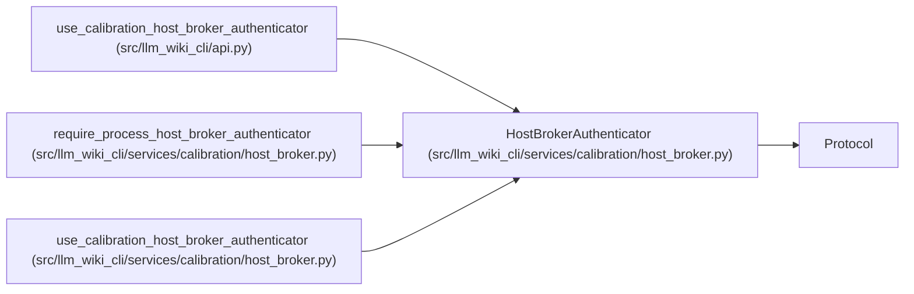

# HostBrokerAuthenticator

**Location:** `src/llm_wiki_cli/services/calibration/host_broker.py:141`
**Kind:** Class
**Bases:** `Protocol`
**Module:** [host_broker](../modules/host_broker.md)

**Decorators:** `@runtime_checkable`

## Description

Supported protocol implemented after protected host authentication.

## Attributes

*No annotated attributes found.*

## Methods

| Method | Signature | Decorators | Description |
|--------|-----------|------------|-------------|
| `authenticator_id` | `() -> str` | `@property` | Return a stable identity for the host authentication implementation. |
| `authenticate_attestation` | `(*, cohort_id: str, authority_grant: Mapping[str, Any], execution_manifest: Mapping[str, Any], attestation: Mapping[str, Any], attestation_hash: str) -> HostBrokerAuthenticationProof` | — | Authenticate and bind one broker attestation. |
| `authenticate_receipt` | `(*, cohort_id: str, execution_manifest: Mapping[str, Any], attestation: Mapping[str, Any], receipt: Mapping[str, Any], receipt_hash: str, result: Mapping[str, Any], result_hash: str) -> HostBrokerAuthenticationProof` | — | Authenticate and bind one external dispatch receipt. |

## Relationships

<!-- Auto-generated relationship summary. Do not edit by hand. -->

### Summary

| Module | Methods | Attributes |
|---|---:|---|
| [host_broker](../modules/host_broker.md) | 3 | — |

### Structure

| Kind | Entity | Module |
|---|---|---|
| Base | `Protocol` | — |

### References

| Reference | Kind | Source |
|---|---|---|
| `use_calibration_host_broker_authenticator` | type_reference | [api](../modules/api.md) |
| `require_process_host_broker_authenticator` | type_reference | [host_broker](../modules/host_broker.md) |
| `use_calibration_host_broker_authenticator` | type_reference | [host_broker](../modules/host_broker.md) |
