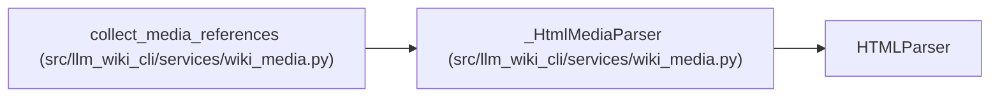

# _HtmlMediaParser

**Location:** `src/llm_wiki_cli/services/wiki_media.py:71`
**Kind:** Class
**Bases:** `HTMLParser`
**Module:** [wiki_media](../modules/wiki_media.md)

## Description

_Auto-generated from `_HtmlMediaParser` in `src/llm_wiki_cli/services/wiki_media.py`._

## Attributes

*No annotated attributes found.*

## Methods

| Method | Signature | Decorators | Description |
|--------|-----------|------------|-------------|
| `__init__` | `() -> None` | — | — |
| `handle_starttag` | `(tag: str, attrs: list[tuple[str, Optional[str]]]) -> None` | — | — |

## Relationships

<!-- Auto-generated relationship summary. Do not edit by hand. -->

### Summary

| Module | Methods | Attributes |
|---|---:|---|
| [wiki_media](../modules/wiki_media.md) | 2 | — |

### Structure

| Kind | Entity | Module |
|---|---|---|
| Base | `HTMLParser` | — |

### References

| Reference | Kind | Source |
|---|---|---|
| `collect_media_references` | call | [wiki_media](../modules/wiki_media.md) |
