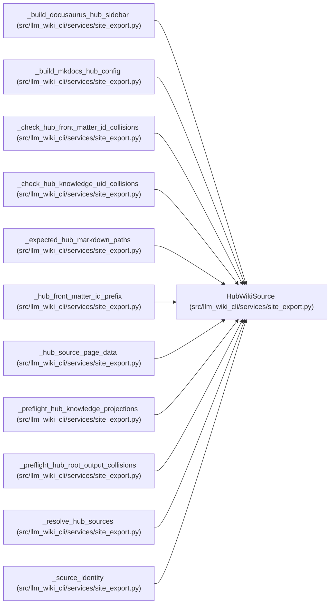

# HubWikiSource

**Location:** `src/llm_wiki_cli/services/site_export.py:272`
**Kind:** Class
**Bases:** —
**Module:** [site_export](../modules/site_export.md)

**Decorators:** `@dataclass(frozen=True)`

## Description

_Auto-generated from `HubWikiSource` in `src/llm_wiki_cli/services/site_export.py`._

## Attributes

| Name | Type | Default | Description |
|------|------|---------|-------------|
| `source_id` | `str` | *required* | — |
| `wiki_dir` | `Path` | *required* | — |

## Methods

*No public methods. Inherits from base classes.*

## Relationships

<!-- Auto-generated relationship summary. Do not edit by hand. -->

### Summary

| Module | Methods | Attributes |
|---|---:|---|
| [site_export](../modules/site_export.md) | 0 | `source_id`, `wiki_dir` |

### References

| Reference | Kind | Source | Call sites |
|---|---|---|---:|
| `_build_docusaurus_hub_sidebar` | type_reference | [site_export](../modules/site_export.md) | — |
| `_build_mkdocs_hub_config` | type_reference | [site_export](../modules/site_export.md) | — |
| `_check_hub_front_matter_id_collisions` | type_reference | [site_export](../modules/site_export.md) | — |
| `_check_hub_knowledge_uid_collisions` | type_reference | [site_export](../modules/site_export.md) | — |
| `_expected_hub_markdown_paths` | type_reference | [site_export](../modules/site_export.md) | — |
| `_hub_front_matter_id_prefix` | type_reference | [site_export](../modules/site_export.md) | — |
| `_hub_source_page_data` | type_reference | [site_export](../modules/site_export.md) | — |
| `_preflight_hub_knowledge_projections` | type_reference | [site_export](../modules/site_export.md) | — |
| `_preflight_hub_root_output_collisions` | type_reference | [site_export](../modules/site_export.md) | — |
| `_resolve_hub_sources` | call | [site_export](../modules/site_export.md) | 2 |
| `_resolve_hub_sources` | type_reference | [site_export](../modules/site_export.md) | — |
| `_source_identity` | type_reference | [site_export](../modules/site_export.md) | — |

> References: showing 12 of 13 logical references; 1 omitted by the 12-row generated summary limit.
