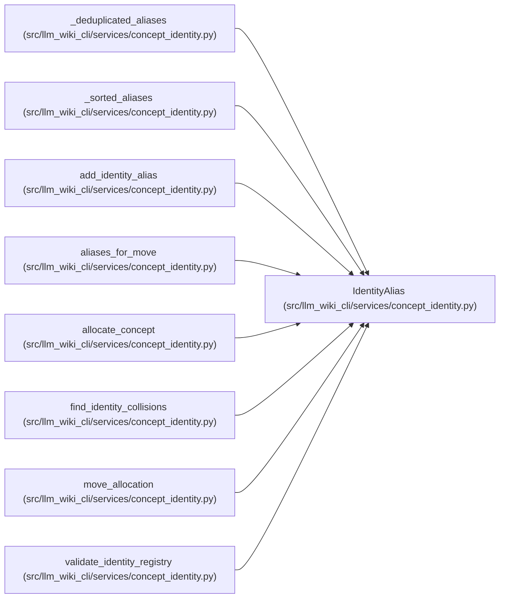

# IdentityAlias

**Location:** `src/llm_wiki_cli/services/concept_identity.py:153`
**Kind:** Class
**Bases:** —
**Module:** [concept_identity](../modules/concept_identity.md)

**Decorators:** `@dataclass(frozen=True)`

## Description

One historical locator or natural key owned by a persisted UID.

## Attributes

| Name | Type | Default | Description |
|------|------|---------|-------------|
| `alias_type` | `AliasType \| str` | *required* | — |
| `value` | `str` | *required* | — |
| `uid` | `str` | *required* | — |

## Methods

| Method | Signature | Decorators | Description |
|--------|-----------|------------|-------------|
| `__post_init__` | `() -> None` | — | — |

## Relationships

<!-- Auto-generated relationship summary. Do not edit by hand. -->

### Summary

| Module | Methods | Attributes |
|---|---:|---|
| [concept_identity](../modules/concept_identity.md) | 1 | `alias_type`, `uid`, `value` |

### References

| Reference | Kind | Source | Call sites |
|---|---|---|---:|
| `_deduplicated_aliases` | type_reference | [concept_identity](../modules/concept_identity.md) | — |
| `_sorted_aliases` | type_reference | [concept_identity](../modules/concept_identity.md) | — |
| `add_identity_alias` | call | [concept_identity](../modules/concept_identity.md) | 1 |
| `add_identity_alias` | type_reference | [concept_identity](../modules/concept_identity.md) | — |
| `aliases_for_move` | call | [concept_identity](../modules/concept_identity.md) | 2 |
| `aliases_for_move` | type_reference | [concept_identity](../modules/concept_identity.md) | — |
| `allocate_concept` | type_reference | [concept_identity](../modules/concept_identity.md) | — |
| `find_identity_collisions` | type_reference | [concept_identity](../modules/concept_identity.md) | — |
| `move_allocation` | type_reference | [concept_identity](../modules/concept_identity.md) | — |
| `validate_identity_registry` | type_reference | [concept_identity](../modules/concept_identity.md) | — |
