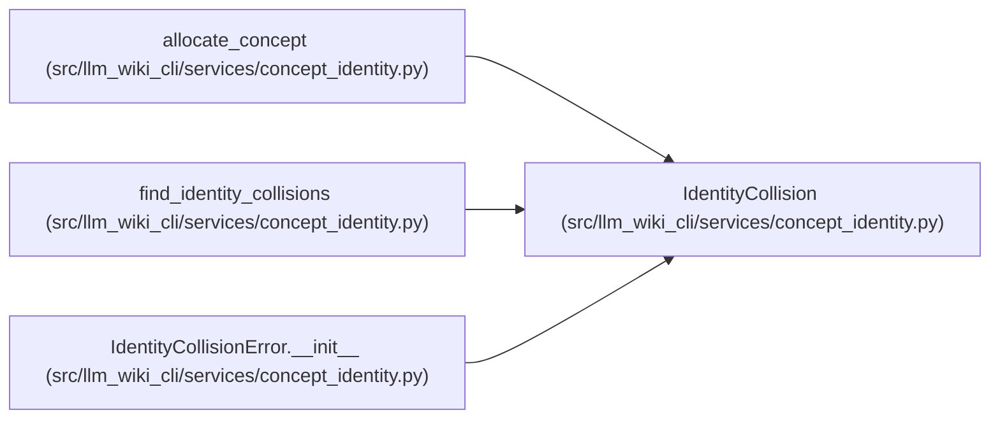

# IdentityCollision

**Location:** `src/llm_wiki_cli/services/concept_identity.py:170`
**Kind:** Class
**Bases:** —
**Module:** [concept_identity](../modules/concept_identity.md)

**Decorators:** `@dataclass(frozen=True, order=True)`

## Description

One deterministic registry conflict found without resolving it.

## Attributes

| Name | Type | Default | Description |
|------|------|---------|-------------|
| `code` | `str` | *required* | — |
| `coordinate_type` | `str` | *required* | — |
| `value` | `str` | *required* | — |
| `uids` | `tuple[str, ...]` | *required* | — |

## Methods

| Method | Signature | Decorators | Description |
|--------|-----------|------------|-------------|
| `__post_init__` | `() -> None` | — | — |

## Relationships

<!-- Auto-generated relationship summary. Do not edit by hand. -->

### Summary

| Module | Methods | Attributes |
|---|---:|---|
| [concept_identity](../modules/concept_identity.md) | 1 | `code`, `coordinate_type`, `uids`, `value` |

### References

| Reference | Kind | Source | Call sites |
|---|---|---|---:|
| `allocate_concept` | call | [concept_identity](../modules/concept_identity.md) | 2 |
| `find_identity_collisions` | call | [concept_identity](../modules/concept_identity.md) | 6 |
| `find_identity_collisions` | type_reference | [concept_identity](../modules/concept_identity.md) | — |
| `IdentityCollisionError.__init__` | type_reference | [concept_identity](../modules/concept_identity.md) | — |
