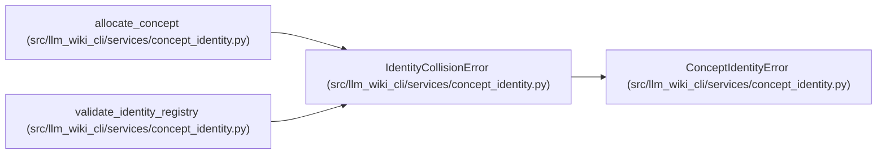

# IdentityCollisionError

**Location:** `src/llm_wiki_cli/services/concept_identity.py:214`
**Kind:** Class
**Bases:** `ConceptIdentityError`
**Module:** [concept_identity](../modules/concept_identity.md)

## Description

Raised when allocations or aliases do not form a unique registry.

## Attributes

*No annotated attributes found.*

## Methods

| Method | Signature | Decorators | Description |
|--------|-----------|------------|-------------|
| `__init__` | `(collisions: Sequence[IdentityCollision])` | — | — |

## Relationships

<!-- Auto-generated relationship summary. Do not edit by hand. -->

### Summary

| Module | Methods | Attributes |
|---|---:|---|
| [concept_identity](../modules/concept_identity.md) | 1 | — |

### Structure

| Kind | Entity | Module |
|---|---|---|
| Base | `ConceptIdentityError` | [concept_identity](../modules/concept_identity.md) |

### References

| Reference | Kind | Source |
|---|---|---|
| `allocate_concept` | call | [concept_identity](../modules/concept_identity.md) |
| `allocate_concept` | call | [concept_identity](../modules/concept_identity.md) |
| `validate_identity_registry` | call | [concept_identity](../modules/concept_identity.md) |
