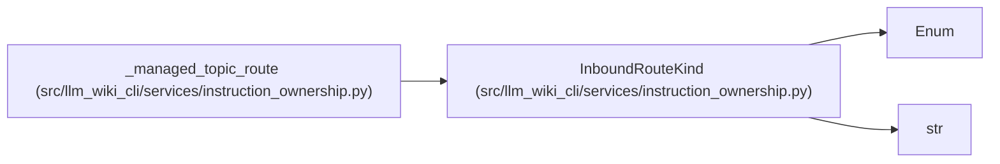

# InboundRouteKind

**Location:** `src/llm_wiki_cli/services/instruction_ownership.py:63`
**Kind:** Enum
**Bases:** `str`, `Enum`
**Module:** [instruction_ownership](../modules/instruction_ownership.md)

## Description

Supported source-level route shapes into managed references.

## Attributes

| Name | Declared value | Description |
|------|-------|-------------|
| `MARKDOWN_LINK` | `'markdown_link'` | — |
| `HEADING_REFERENCE` | `'heading_reference'` | — |
| `INSTALLED_FILE_ROUTE` | `'installed_file_route'` | — |
| `REFERENCE_ROOT` | `'reference_root'` | — |

## Methods

*No public methods. Inherits from base classes.*

## Relationships

<!-- Auto-generated relationship summary. Do not edit by hand. -->

### Summary

| Module | Methods | Attributes |
|---|---:|---|
| [instruction_ownership](../modules/instruction_ownership.md) | 0 | `HEADING_REFERENCE`, `INSTALLED_FILE_ROUTE`, `MARKDOWN_LINK`, `REFERENCE_ROOT` |

### Structure

| Kind | Entity | Module |
|---|---|---|
| Base | `Enum` | — |
| Base | `str` | — |

### References

| Reference | Kind | Source |
|---|---|---|
| `_managed_topic_route` | type_reference | [instruction_ownership](../modules/instruction_ownership.md) |
