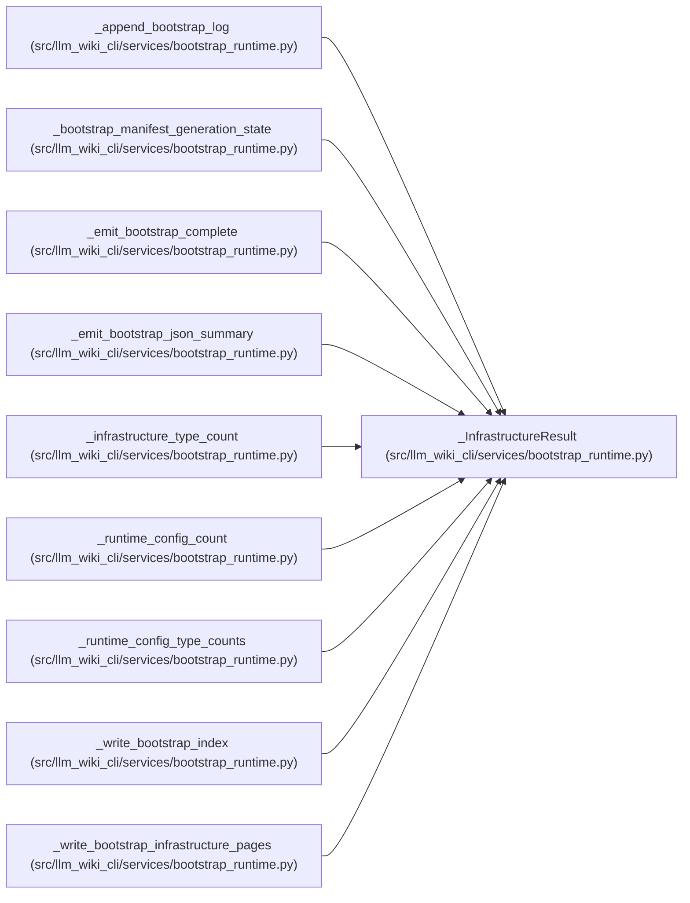

# _InfrastructureResult

**Location:** `src/llm_wiki_cli/services/bootstrap_runtime.py:4169`
**Kind:** Class
**Bases:** —
**Module:** [bootstrap_runtime](../modules/bootstrap_runtime.md)

**Decorators:** `@dataclass(frozen=True)`

## Description

_Auto-generated from `_InfrastructureResult` in `src/llm_wiki_cli/services/bootstrap_runtime.py`._

## Attributes

| Name | Type | Default | Description |
|------|------|---------|-------------|
| `entries` | `list[dict]` | *required* | — |
| `created` | `int` | *required* | — |
| `docker_inventory` | `dict` | *required* | — |
| `yaml_inventory` | `dict` | *required* | — |
| `infrastructure_inventory` | `dict` | *required* | — |
| `written_sources` | `tuple[str, ...]` | `()` | — |
| `skipped_sources` | `tuple[str, ...]` | `()` | — |

## Methods

*No public methods. Inherits from base classes.*

## Relationships

<!-- Auto-generated relationship summary. Do not edit by hand. -->

### Summary

| Module | Methods | Attributes |
|---|---:|---|
| [bootstrap_runtime](../modules/bootstrap_runtime.md) | 0 | `created`, `docker_inventory`, `entries`, `infrastructure_inventory`, `skipped_sources`, `written_sources`, `yaml_inventory` |

### References

| Reference | Kind | Source | Call sites |
|---|---|---|---:|
| `_append_bootstrap_log` | type_reference | [bootstrap_runtime](../modules/bootstrap_runtime.md) | — |
| `_bootstrap_manifest_generation_state` | type_reference | [bootstrap_runtime](../modules/bootstrap_runtime.md) | — |
| `_emit_bootstrap_complete` | type_reference | [bootstrap_runtime](../modules/bootstrap_runtime.md) | — |
| `_emit_bootstrap_json_summary` | type_reference | [bootstrap_runtime](../modules/bootstrap_runtime.md) | — |
| `_infrastructure_type_count` | type_reference | [bootstrap_runtime](../modules/bootstrap_runtime.md) | — |
| `_runtime_config_count` | type_reference | [bootstrap_runtime](../modules/bootstrap_runtime.md) | — |
| `_runtime_config_type_counts` | type_reference | [bootstrap_runtime](../modules/bootstrap_runtime.md) | — |
| `_write_bootstrap_index` | type_reference | [bootstrap_runtime](../modules/bootstrap_runtime.md) | — |
| `_write_bootstrap_infrastructure_pages` | call | [bootstrap_runtime](../modules/bootstrap_runtime.md) | 1 |
| `_write_bootstrap_infrastructure_pages` | type_reference | [bootstrap_runtime](../modules/bootstrap_runtime.md) | — |
